\newpage

# Címlap

Szegedi Tudományegyetem
Informatikai Intézet

# SZAKDOLGOZAT

Pesz Szabolcs
2026

\newpage

Szegedi Tudományegyetem
Informatikai Intézet

**ParkVision: Okos parkolásmenedzsment-rendszer**

Szakdolgozat

| Készítette: | Témavezető: |
|---|---|
| **Pesz Szabolcs** | **Dr. Bilicki Vilmos** |
| programtervező informatikus | egyetemi adjunktus |
| szakos hallgató | |

Szeged
2026

\newpage

# Feladatkiírás

A városi parkolás napjaink egyik legfájdalmasabb mindennapi problémája: a vásárlók percekig vagy akár negyedórákig keringnek a bevásárlóközpontok parkolóiban anélkül, hogy biztos információjuk lenne a szabad helyekről, miközben az üzemeltetők nem rendelkeznek egységes, valós idejű képpel a saját létesítményeik kihasználtságáról.

A feladat egy olyan webes rendszer készítése, amely a látogatók számára publikusan, a bevásárlóközpontok üzemeltetői számára pedig adminisztratív felületen keresztül teszi átláthatóvá a parkolóhelyek pillanatnyi foglaltságát. A rendszernek támogatnia kell a központok böngészését térképen, a valós idejű foglaltsági mutatók megjelenítését, valamint a regisztrált felhasználók számára a parkolóhely-foglalás funkciót.

A megvalósítás során használjon modern, komponens-alapú frontend keretrendszert (React, Vite, TypeScript), saját REST backend-et perzisztens adattárolással (Express, SQLite), és egy IoT-szimulátort, amely a valós szenzorok beérkezését megelőzve generálja a foglaltsági adatokat. A rendszert legalább egy demó-környezetben (Vercel) telepíteni szükséges, és olyan tesztelési és CI/CD-folyamatot kell kialakítani, amely a kód minőségét folyamatosan ellenőrzi.

\newpage

# Tartalmi összefoglaló

**Téma megnevezése**:
ParkVision — Okos parkolásmenedzsment-rendszer bevásárlóközpontok számára.

**A megadott feladat megfogalmazása**:
A feladat egy olyan webes alkalmazás létrehozása, amely a budapesti bevásárlóközpontok parkolóinak valós idejű foglaltságát átláthatóvá teszi a látogatóknak (publikus felület), és teljes körű menedzsment-eszközt nyújt a központok üzemeltetőinek (admin felület). A rendszernek támogatnia kell a parkolóhely-foglalást, a térképes navigációt, valamint a foglaltsági trendek megjelenítését vezérlőpulton.

**Megoldási mód**:
A frontend React 18 alapú egyoldalas alkalmazás (SPA) TypeScript nyelven, Material-UI design-rendszerrel és Vite build-eszközzel. A backend Node.js alapú Express szerver, ugyancsak TypeScript-ben, perzisztens SQLite adatbázissal (better-sqlite3 driveren keresztül). A frontend és a backend között REST API-n folyik a kommunikáció JWT-alapú tokenes hitelesítéssel. A foglaltsági adatok valós idejű frissülését egy 30 másodpercenként futó IoT-szimulátor szolgáltatja, amely az igazi szenzoros adatfolyam helyettesítője.

**Alkalmazott eszközök, módszerek**:
A fejlesztés Visual Studio Code-ban és Cursor-ban történt. A frontenden React 18, TypeScript 5, Material-UI 5, TanStack Query 4, React Router 6, Leaflet (térkép), Recharts (diagramok), notistack (toast üzenetek), framer-motion (animációk), valamint i18next (kétnyelvűség) található. A backenden Express, better-sqlite3, jsonwebtoken, bcryptjs és Zod (validáció). Tesztelésre Vitest és React Testing Library szolgál, az integrációs tesztek MSW-vel (Mock Service Worker) futnak. A CI/CD GitHub Actions-szel automatizált, a deploy Vercel platformon történik. Az infrastruktúra-mint-kód (IaC) Terraform-mal van leírva.

**Elért eredmények**:
Az alkalmazás működőképes formában publikusan elérhető a `https://szakdolgozat-chi.vercel.app/` címen. A teljes funkcionalitás (publikus böngészés, térkép, foglalás, vezérlőpult, adminisztratív panel) implementálva és tesztekkel lefedve van. A rendszer 54 automatizált tesztet tartalmaz (40 frontend, 14 backend), GitHub Actions-en zöld build-del. A kétnyelvűség (magyar–angol), a világos és sötét téma, valamint a Progressive Web App (PWA) képességek (offline indikátor, telepíthetőség) is rendelkezésre állnak.

**Kulcsszavak**:
parkolásmenedzsment, IoT, bevásárlóközpont, valós idejű foglaltság, foglalás, React, TypeScript, Express, SQLite, JWT, Vercel, PWA, mesterséges intelligencia támogatott fejlesztés.

\newpage

# Bevezetés

A városi parkolás kérdése évek óta az egyik legmegoldatlanabb városüzemeltetési probléma. Egy 2017-es INRIX kutatás szerint a budapesti vezetők átlagosan évi 51 órát töltenek parkolóhely-keresgéléssel [1], és ez az adat azóta sem javult érdemben. A probléma különösen érzékelhető a bevásárlóközpontok parkolóiban: csúcsidőben (péntek délután, szombat délelőtt, ünnepek előtt) a látogatók 10–15 percet is eltölthetnek azzal, hogy a több ezer férőhelyes parkolókban szabad helyet keresnek, miközben a parkoló *valós* foglaltságáról nincs naprakész információjuk.

A jelenség nem csak a vásárlókat érinti. A bevásárlóközpont-üzemeltetőknek sincs egységes, valós idejű képük arról, hogy mekkora a parkolóik kihasználtsága; legtöbbjük heti vagy havi összegző jelentéseket kap, amelyek alapján csak utólag, akár egy hónapos késéssel tudnak intézkedni. A szezonális csúcsok kezelésére, a területek (zónák) átcsoportosítására, vagy a teltség miatt elveszített látogatók számbavételére jelenleg nincs kiforrott eszköz a középkategóriás létesítmények piacán.

Ezeknek a problémáknak a megoldására készült el a **ParkVision** webes alkalmazás, amely egyszerre két célcsoportot szolgál ki: a *látogatókat* — akik publikusan, regisztráció nélkül böngészhetik a központok pillanatnyi foglaltságát térképen és listában —, valamint az *üzemeltetőket* — akik bejelentkezés után részletes vezérlőpulton követhetik a saját létesítményeik kihasználtságát, kezelhetik a parkolóhelyek és zónák állapotát, és utánanézhetnek a múltbeli foglaltsági trendeknek.

A rendszer fő erőssége, hogy a parkolóhelyek foglaltsági adatait egy szimulált IoT-rendszer **30 másodpercenként frissíti**, így a felhasználói felület valós idejű képet ad. Bár a Sprint 02-es leadásban ezt szimulátor szolgáltatja, az architektúra úgy van megtervezve, hogy a valódi szenzorok integrációja egyetlen modul lecserélésével megoldható.

A szakdolgozatomban nagy hangsúlyt fektettem arra, hogy a felhasználói felület mindkét célközönség számára *könnyen használható* legyen. Ezért a látogatói oldal nem igényel regisztrációt a böngészéshez, az admin felület pedig egyetlen oldalról elérhető navigációval támogatja az üzemeltetők munkafolyamatait. A mobil eszközökön való használhatóságot (responsive design) és a sötét/világos téma választhatóságát szintén az alapkövetelmények közé soroltam, mert a parkolásinformáció jellemzően útközben, mobil eszközön kerül lekérdezésre.

Az alkalmazás *kétnyelvű* (magyar és angol), így nem csak a hazai, hanem a Budapestre érkező külföldi vendégek is kényelmesen használhatják.

A fejlesztés során több mesterséges intelligencia eszközt is használtam (Claude Code, GitHub Copilot, ChatGPT, Gemini), és a folyamatot tudatosan dokumentáltam egy strukturált logban. A 12. fejezet ezen tapasztalatokat foglalja össze — kitérve arra is, hogy hol *nem* használtam MI-t, és mit tanultam a folyamatból.

A szakdolgozat a továbbiakban a meglévő piaci alkalmazások áttekintésével kezdődik (1. fejezet), majd a funkcionális specifikációval és a tervezett megjelenéssel folytatódik (2–3. fejezet). Ezt követi a felhasznált technológiák (4. fejezet), az architektúra (5. fejezet), és a belső felépítés (6. fejezet) részletes tárgyalása. A 7. fejezet a biztonsági megfontolásokat, a 8. az adatmodellt, a 9. a magas szintű folyamatokat, a 10. pedig a fontosabb kódrészleteket mutatja be. A 11. fejezetben a fejlesztés során szerzett tapasztalatokat és a továbbfejlesztési lehetőségeket gyűjtöttem össze, a 12. fejezet pedig a mesterséges intelligencia használatát tárgyalja.

\newpage
# 1. Területi áttekintés

A szakdolgozatom készítésének első lépéseként piackutatást végeztem a hasonló célú alkalmazások között, hogy lássam, melyik képességek számítanak ma alapvetőnek a parkolásmenedzsment-piacon, és melyek azok a hiányosságok, amelyeken az általam fejlesztett rendszer érdemben javíthat. A kutatás során öt jelentős, részben hazai, részben nemzetközi alkalmazást vizsgáltam meg: az **EasyPark** [2] európai szolgáltatót, az **észak-amerikai ParkMobile** [3] és **SpotHero** [4] alkalmazásokat, a hazai **Parkl** [5] szolgáltatást, valamint a vállalati területre szakosodott **NaviParking** [6] és **Park360** [7] platformokat.

| Alkalmazás | Térkép | Valós idejű foglaltság | Foglalás | Sorompóvezérlés | Több helyszín | Admin felület | Magyar nyelv |
|---|:---:|:---:|:---:|:---:|:---:|:---:|:---:|
| EasyPark | ✓ | ✓ (heurisztikus) | ✓ | – | ✓ | – | ✓ |
| ParkMobile | ✓ | – (zóna-alapú) | ✓ | – | ✓ | ✓ (üzleti) | – |
| SpotHero | ✓ | – | ✓ (akár 6 hét) | – | ✓ | – | – |
| Parkl | ✓ | ✓ | ✓ | ✓ | ✓ | ✓ | ✓ |
| Park360 / NaviParking | – | ✓ | ✓ | ✓ | ✓ | ✓ | – |
| **ParkVision (saját)** | **✓** | **✓ (30 mp)** | **✓** | **–** | **✓** | **✓** | **✓** |

*1.1. táblázat: A vizsgált parkolási alkalmazások funkcionális összehasonlítása.*

A táblázatból látható, hogy a piacon számos alkalmazás létezik, de a kombináció — térkép, valós idejű foglaltság, foglalás, magyar nyelvű admin felület — egyetlen ingyenes, hazai megoldásnál sem áll teljesen rendelkezésre.

## 1.1. EasyPark

Az EasyPark [2] az európai parkolási piac egyik legnagyobb szereplője, amely 2024-ben felvásárolta az észak-amerikai ParkMobile-t is. Az alkalmazás Magyarországon is elérhető, a nyelvtámogatottság között szerepel a magyar. A legfontosabb funkciója a *FIND*, amely adatelemzéssel becsli meg, hogy egy adott utcán mekkora valószínűséggel találunk szabad parkolóhelyet, és ezt az utca színének változtatásával jelzi a térképen. Az alkalmazás támogatja az előzetes foglalást is, de leginkább az utcai parkolásra fókuszál — a bevásárlóközpontok parkolóira nem terjed ki.

## 1.2. ParkMobile

A ParkMobile [3] elsődlegesen az Egyesült Államok és Kanada területén működik, több mint 500 városban. A működési modell a *zóna-alapú parkolás*: a felhasználó a parkolóhely melletti táblán látható zónaszámot beírja az alkalmazásba, kiválasztja az időtartamot, és elindítja a parkolási menetet. Az alkalmazás nem ad valós idejű foglaltsági információt, csak az adott zóna szabályait mutatja meg. Az új *Reserve* funkcióval előre fizethető garázs- és parkoló-foglalás is elérhető rajta. Az alkalmazás 2024 óta az EasyPark Group része.

## 1.3. SpotHero

A SpotHero [4] kifejezetten az *off-street* (parkolóházi és garázsbeli) parkolóhelyek előzetes foglalására specializált alkalmazás. Az Egyesült Államok 400 városában több mint 13.000 parkolóhelyhez biztosít hozzáférést, repülőtéri parkolókhoz akár 364 napos előrelátással. A szolgáltatás kiemelt erőssége, hogy a felhasználók akár 50%-os kedvezményt is elérhetnek az előzetes foglalással szemben az on-site fizetéssel. A SpotHero integrálva van az Apple CarPlay rendszerével is, ami lehetővé teszi a foglalás kezelését a telefon érintése nélkül, vezetés közben.

## 1.4. Parkl

A Parkl [5] a leghasonlóbb hazai alkalmazás a ParkVision koncepciójához. A magyar tulajdonú szolgáltatás bevásárlóközpontok, hotelek, irodaházak és lakóparkok parkolóit teszi elérhetővé az alkalmazáson keresztül. A felhasználó a térképen látja a közelben lévő parkolási lehetőségeket, valós idejű elérhetőséggel. A legfontosabb funkciója a sorompó-integráció: az alkalmazás közvetlenül vezérelheti a beléptető rendszereket, így a felhasználó a parkolóhoz érve mobil rendszámfelismerés vagy QR-kód alapján belép. A Parkl e-mobility (elektromos töltés) szolgáltatást is integrált a 2023-as bővítéskor. Bár funkcionalitásában gazdag, a Parkl elsősorban a *fizetésre* fókuszál; a nem-felhasználók (anonim böngészés) számára a kínált információ erősen korlátozott.

## 1.5. Park360 és NaviParking

A Park360 [7] és a NaviParking [6] vállalati piacra szánt smart parking platformok, amelyek a meglévő parkolási infrastruktúrát digitalizálják. Tipikus integrációjuk a kamerával bővített sorompó (rendszámolvasással), QR-kód alapú beléptetés, és egy webes admin felület a parkolóüzemeltető számára. Felhasználói oldalról egy mobil applikációban foglalhat a regisztrált sofőr. Mindkét platform B2B-elszámolású, és nem érhető el ingyenesen, ezért a hazai kkv-k és bevásárlóközpontok ritkán választják őket.

A piackutatás összefoglalva azt mutatta, hogy *(1)* a **térképes valós idejű foglaltság** és *(2)* a **többnyelvű, ingyenes, üzemeltetői admin felület** kombinációja egyetlen vizsgált alkalmazásnál sem található meg úgy, hogy közben a vásárlói oldal regisztráció nélkül használható. Ez az a niche, amit a ParkVision igyekszik betölteni.

\newpage

# 2. Funkcionális specifikáció

A használati eset diagram segítségével a rendszer által kínált funkcionalitásokat és az azokat használó aktorok közötti kapcsolatokat modellezhetjük le a legmagasabb absztrakciós fokon. Az aktorok a rendszerrel valamilyen módon interakcióba lépő felhasználók, míg a használati esetek a rendszer által kínált funkciók. A diagramok bemutatják a rendszer tervezett funkcióit, környezetét és ezek kapcsolatait.

A ParkVision rendszerben három felhasználói szerepkört különböztetek meg: a *vendég felhasználót* (látogatót), a *regisztrált felhasználót* és az *admin felhasználót*. A három csoport között szerepkör-alapú jogosultsági hierarchia áll fenn: az admin minden jogosultsággal rendelkezik, amivel a regisztrált felhasználó, és a regisztrált felhasználó minden jogosultsággal, amivel a vendég. A 2.1. ábra mutatja be a teljes használati eset diagramot.

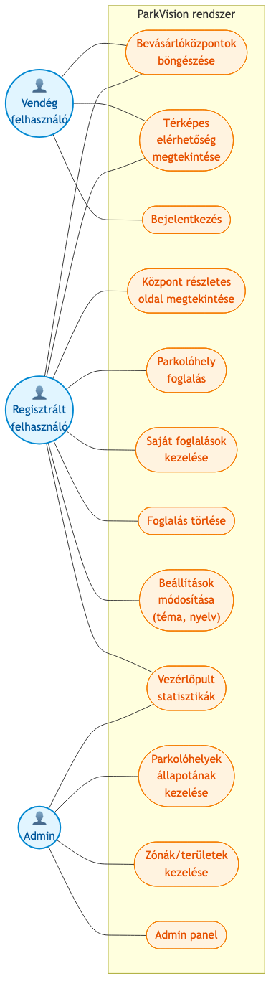

## 2.1. Vendég felhasználó

A *vendég* felhasználók a webalkalmazás publikus felületét regisztráció nélkül használhatják. A legfontosabb funkciók, amelyek számukra elérhetők:

- **Bevásárlóközpontok böngészése**: a felhasználó listán és térképen is megtekintheti a rendszerbe felvett bevásárlóközpontokat, azok jelenlegi foglaltsági adataival, nyitvatartásával és címével.
- **Térképes elérhetőség megtekintése**: az interaktív Leaflet-térképen a vendég látja a központok földrajzi elhelyezkedését, és a foglaltsági szintet vizuálisan, színkódolt jelölőkkel.
- **Bejelentkezés**: ha már rendelkeznek regisztrált fiókkal, bejelentkezhetnek, hogy hozzáférjenek a bővített funkciókhoz.

A vendégeknek nincs lehetőségük foglalásra, vezérlőpult-megtekintésre vagy az adminisztratív funkciók használatára. Ennek a megkötésnek az oka egyszerre üzleti és technikai: egyrészt biztosítani kell a foglalásokhoz az azonosítható felhasználót (foglalási visszaélések elkerülésére), másrészt a vezérlőpult érzékeny üzemeltetői adatokat tartalmaz.

## 2.2. Regisztrált felhasználó (látogató)

A regisztrált felhasználók a vendég jogosultságainak teljes körén túl a következő funkciókat érhetik el:

- **Központ részletes oldala**: egy adott bevásárlóközpontra kattintva részletes információs oldalt láthatnak, ahol a foglalási lehetőség is megjelenik.
- **Parkolóhely-foglalás**: kiválaszthatnak egy szabad időslot-ot (jövőbeli kezdési és befejezési idővel), és lefoglalhatják a férőhelyet. A rendszer ellenőrzi, hogy a slot a jövőben van, hogy a központ nincs telve, és hogy a felhasználónak nincs már aktív foglalása ugyanarra az időpontra.
- **Saját foglalások kezelése**: külön oldalon megtekinthetik az aktív és lemondott foglalásaikat.
- **Foglalás törlése**: az aktív foglalásokat egy gombnyomással lemondhatják (a státusz `cancelled` lesz).
- **Beállítások módosítása**: a felhasználói felület nyelvét magyar és angol között váltogathatják, illetve világos és sötét téma között választhatnak. Ezeket a preferenciákat a rendszer a böngésző `localStorage`-ében tárolja, és a következő látogatáskor automatikusan visszaállítja.

## 2.3. Admin felhasználó

Az admin felhasználó a regisztrált felhasználó összes jogosultsága mellett az alábbi adminisztratív funkciókat is elérheti:

- **Vezérlőpult**: KPI-kártyák (összes bevásárlóközpont, összes parkolóhely, jelenleg foglalt, szabad), valós idejű foglaltsági trendek diagramon, és a központok kihasználtsága gradienskódolt listában.
- **Parkolóhelyek állapotának kezelése**: a `/spaces` oldalon az adminisztrátor minden egyes parkolóhely státuszát manuálisan módosíthatja (pl. szervizelés miatti zárolás esetén).
- **Zónák és területek kezelése**: a `/areas` oldalon a központon belüli zónákat (pl. mozgáskorlátozott, családi, e-töltő) kezelheti.
- **Admin panel**: külön analitikai oldal Recharts-alapú diagramokkal a múltbéli foglaltsági adatokról.

A háromszintű szerepkörmodell jól skálázódik: ha a jövőben szükségessé válna egy negyedik szerep (pl. `operator` az egyetlen központhoz tartozó üzemeltető számára), az minimális kódmódosítással beilleszthető a meglévő `requireRole` middleware-be.

\newpage

# 3. Tervezett megjelenés

A webalkalmazás megjelenésében nagy hangsúlyt fektettem a használhatóságra és a vizuális koherenciára. A ParkVision két nyelvet (magyar és angol) támogat, és két megjelenési témát kínál: világos és sötét. A téma- és nyelvválasztás minden oldalon érvényes, és a felhasználó beállításai a `localStorage`-ben tárolódnak.

A reszponzivitásra is nagy hangsúlyt fektettem, mert a parkolásinformációt jellemzően útközben, mobil eszközön kérdezi le a felhasználó. A Material-UI alapértelmezett breakpointjai (xs, sm, md, lg, xl) szerint a felület 360 pixeltől (kis mobil) 1920 pixelig (asztali monitor) folyamatosan adaptálódik.

## 3.1. Publikus kezdőoldal

A publikus kezdőoldal a felhasználók első találkozási pontja a rendszerrel. A felső szekcióban egy hős-elem (hero section) található, amely egyértelműen kommunikálja az alkalmazás célját: *„Találd meg a legközelebbi szabad parkolóhelyet"*. Alatta egy interaktív Leaflet-térkép helyezkedik el, amelyen a budapesti bevásárlóközpontok foglaltsága látszik színkódolt jelölőkkel (zöld: 0–60%, sárga: 60–85%, piros: 85% felett). A szekció után a központok kártyás listája következik (`ShoppingCenterCard` komponens), ahol a felhasználó név, cím, jelenlegi foglaltság, és nyitvatartás alapján böngészheti az ajánlatokat.

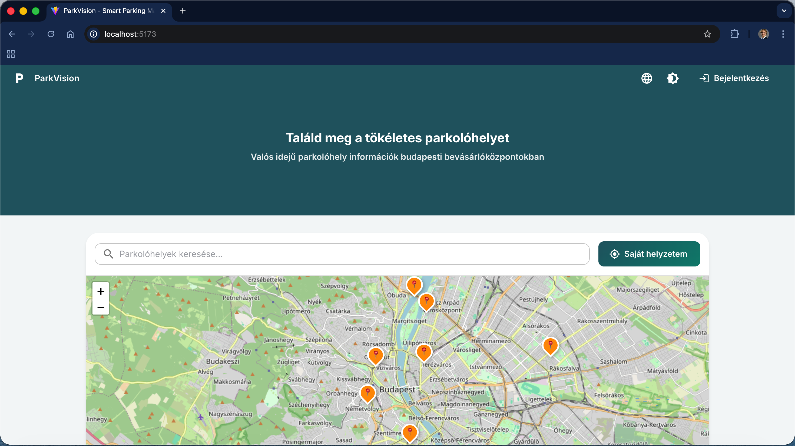

## 3.2. Bejelentkezés

A bejelentkezési oldal egy egyszerű, központosított form-ot használ email és jelszó mezőkkel, valamint egy *Bejelentkezés* gombbal. Az oldalra a felső navigációs sávban található *Bejelentkezés* menüpontból, vagy a publikus oldalon megjelenő foglalási kísérlet esetén juthat el a felhasználó. A bejelentkezés sikere után a rendszer automatikusan a vezérlőpultra navigál.

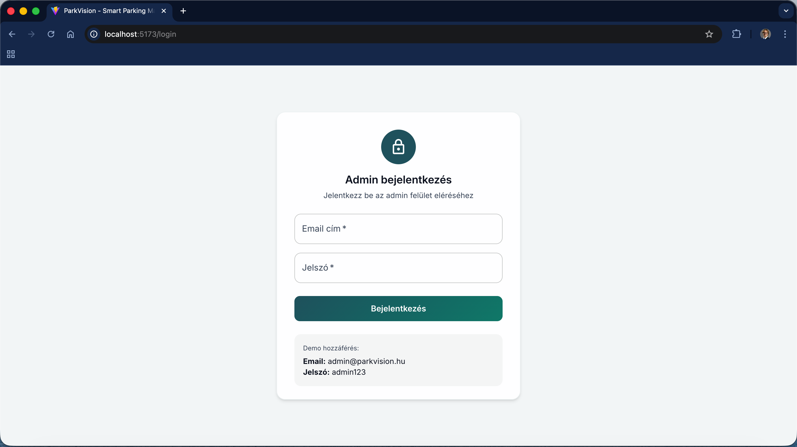

## 3.3. Vezérlőpult

A bejelentkezett felhasználók (admin) első képernyője a vezérlőpult. A felület felső részén négy KPI-kártya található (`StatCard` komponens), amelyek az összes központ számát, az összes parkolóhely-kapacitást, a pillanatnyilag foglalt helyek számát és a szabad helyek számát mutatják. A kártyák alatt egy idősoros diagram (Recharts) jeleníti meg a foglaltsági trendeket, alatta pedig a központok listája szerepel haladásjelzős foglaltsági kijelzéssel.

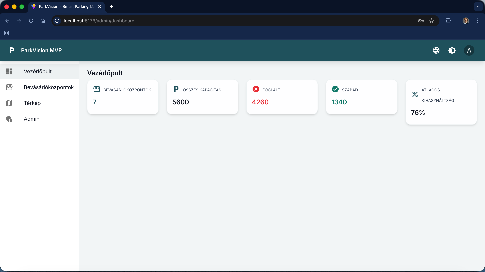

## 3.4. Bevásárlóközpontok oldal

A bevásárlóközpontok oldala egy szűrhető táblázatot tartalmaz a rendszerbe regisztrált létesítményekről. A táblázat oszlopai: név, cím, kapacitás, jelenlegi foglaltság (százalékban és haladásjelzőn), és a legutóbbi frissítés dátuma. A szűrőmező a foglaltsági szint alapján enged szűrni: alacsony (<50%), közepes (50–80%) és magas (>80%). Egy központra kattintva a részletes oldalra navigálunk.

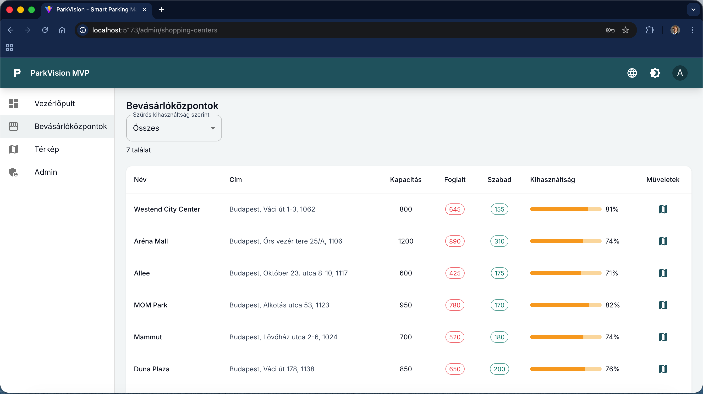

## 3.5. Központ részletes oldal

A részletes oldal a kiválasztott bevásárlóközpontról minden lényegi információt megjelenít: nagyméretű kép, név, cím, nyitvatartás, foglaltsági mutató, leírás. A részletes oldalon található a *Foglalás* gomb is, amely megnyitja a `ReservationModal` modal ablakot.

## 3.6. Foglalás modal

A foglalási űrlap modal ablakban jelenik meg a központ részletes oldaláról. Az űrlap három mezőt tartalmaz: kezdési időpont, befejezési időpont, és egy információs blokkot, amely a felhasználó által választott időslot-ban a központ várható foglaltságát mutatja. Ha a felhasználó múltbéli időpontot választana, a *Megerősítés* gomb tiltott állapotba kerül, és inline validációs hibaüzenet jelenik meg. Ha a központ a választott időslot-ban várhatóan telített (>95%), a rendszer figyelmeztető toast üzenetet jelenít meg. Sikeres foglalás után a modal bezárul, és egy *Foglalás létrehozva* értesítés jelenik meg.

## 3.7. Térkép oldal

A `/map` oldalon egy nagyméretű, teljes képernyős Leaflet-térkép látható az összes bevásárlóközponttal. A térkép automatikusan a felhasználó pozíciójára centrál, ha az engedélyezi a geolokációt. A keresőmezőbe a központ neve vagy címe alapján lehet szűkíteni a találatokat. A térképen kattintva a felhasználó a központ részletes oldalára navigál.


## 3.8. Foglalások oldal

A regisztrált felhasználó a `/reservations` oldalon láthatja a saját foglalásait két fülre (tab) bontva: *Közelgő* (még nem érkezett el a kezdési időpont) és *Múlt* (a kezdési időpont a múltban van, vagy a foglalás `cancelled` státuszú). Minden foglaláshoz tartozik egy *Lemondás* gomb (csak az aktív és jövőbeli foglalásoknál), amely a foglalás státuszát `cancelled`-re módosítja.

## 3.9. Admin panel és további oldalak

Az admin felhasználók számára további specializált oldalak állnak rendelkezésre: parkolóhelyek (*spaces*) táblázat státuszváltási lehetőséggel, zónák (*areas*) áttekintő, és egy elemző admin panel részletes idősoros és kategoriális diagramokkal. Ezek az oldalak az `/admin/...` útvonalon érhetők el, és a `ProtectedRoute` komponens biztosítja, hogy csak `admin` szerepkörű felhasználó férjen hozzá.

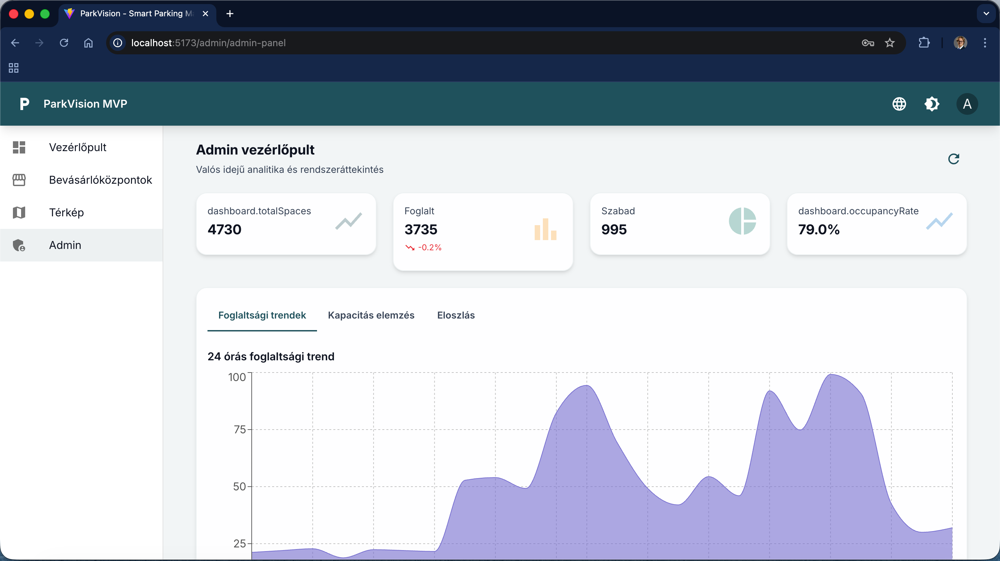

## 3.10. Empty és error állapotok

A használhatóság szempontjából kritikus, hogy a felhasználó minden adat-oldalon ugyanazt a négy állapotot lássa: *betöltés* (animált skeleton), *üres* (illusztrált EmptyState komponens leíró szöveggel), *hiba* (`ErrorBanner` újrapróbálási gombbal), és *sikeres* (a tényleges adat). Ez az egységes állapotkezelés visszaköszön minden oldalon, és nagyban hozzájárul a felhasználói élmény koherenciájához.

\newpage

# 4. Felhasznált technológiák

A ParkVision két fő részből áll: egy frontend egyoldalas alkalmazásból (SPA) és egy önálló backend-szerverből. A két rész egymás között REST API-n kommunikál, JSON adatformátumban. A választott technológiák mindegyikénél az volt a fő szempont, hogy *mainstream*, jól dokumentált és aktívan karbantartott eszközök legyenek, amelyeket egy junior fejlesztő is gyorsan megérthet.

## 4.1. React 18 [8]

A React egy nyílt forráskódú frontend könyvtár, amelyet a Meta (korábban Facebook) fejleszt. A 18-as verzió bevezette a Concurrent Renderinget, amely lehetővé teszi a komponensek prioritás-alapú újra-renderelését. A React komponens-alapú modellje (egyszer-és-csak-egyszer-megírás) ideális választás a ParkVision-höz, mert a felület számos újrahasználható elemből (kártya, modal, KPI-blokk, táblázat) épül fel. A projekt a *standalone components* típusú megközelítést használja, és a Hooks API-t a state-kezeléshez.

## 4.2. TypeScript 5 [9]

A TypeScript a JavaScript szigorú típusrendszerrel kibővített változata. A ParkVision-ben TypeScript szigorú módban (`strict: true`) használtam, ami azt jelenti, hogy minden változó típusa explicit, és a `null` / `undefined` ellenőrzések kötelezőek. A típusok a `src/types/index.ts` fájlban vannak központosítva, és minden fontos domain-objektumhoz (ParkingSpace, Area, Reservation, ShoppingCenter, User) tartoznak interfészek.

## 4.3. Vite 4 [10]

A Vite egy modern build-eszköz, amely az ES modul-natív fejlesztői szervert kombinálja egy Rollup alapú produkciós build-del. A főbb előnye a tradicionális webpack-alapú megoldásokkal szemben a *forró újratöltés* (HMR) sebessége: a Vite tipikusan 100 ms alatt frissíti a böngésző állapotát kódváltozás után. A ParkVision-ben a Vite szolgálja a fejlesztői szervert (port: 5173), és a produkciós build is ezzel készül.

## 4.4. Material-UI (MUI) 5 [11]

A Material-UI a Google Material Design irányelveit követő, gazdag React komponens-könyvtár. A MUI biztosítja a használt UI-elemek többségét (gomb, input, kártya, modal, tab, skeleton, snackbar), valamint a téma-rendszert, ami a világos és sötét téma közötti váltást egyetlen `ThemeProvider` szintjén megvalósítja. A MUI mellett az `@mui/icons-material` csomag biztosítja az ikonkészletet, amit kiegészít néhány saját SVG (pl. parkolási marker).

## 4.5. TanStack Query 4 [12]

A TanStack Query (korábban React Query) az adatlekérés és cache-kezelés állapot-menedzsere. A ParkVision-ben minden HTTP-kérés a TanStack Query egyéni hookjain keresztül történik (`useShoppingCenters`, `useReservations`, `useParkingSpaces`, `useAreas`), így a betöltés, hiba, üres és sikeres állapotok kezelése egységes és deklaratív. A retry-logikát a `QueryClient` szinten konfiguráltam: a sikertelen kérések egyszer újrapróbálkoznak, és a `refetchOnWindowFocus: false` beállítás biztosítja, hogy a felhasználó váltása ne triggereljen felesleges hálózati forgalmat.

## 4.6. React Router 6 [13]

A felületek közötti navigációt a React Router 6 oldja meg. A 6-os verzió bevezette a `<Routes>` és `<Outlet>` komponenseket, amelyek egyszerűbbé teszik a beágyazott útvonalak kezelését. A ParkVision-ben a `Layout` komponens egy `<Outlet>`-et helyez el a fejléce és a sidebarja között, így minden bejelentkezett oldal automatikusan a navigációs sávban renderelődik.

## 4.7. Express + better-sqlite3 [14]

A backend-szerver Express keretrendszerre épül, amely a Node.js világ leggyakrabban használt webszerver-könyvtára. Az adatbázis-kezeléshez a *better-sqlite3* csomagot használtam, amely szinkron API-val biztosít teljes SQL-támogatást egyetlen, fájlrendszerben tárolt SQLite-adatbázishoz. A választás indoka az ADR-0004-ben (`docs/adr/0004-backend-stack.md`) található: az SQLite egyszerűsége (nincs külön szerver, nincs konfiguráció) éles előny egy MVP-fázisban, és a teljesítmény (10.000+ írás/másodperc) bőven elegendő a tervezett terhelés mellett.

## 4.8. JWT és bcryptjs [15]

A felhasználói hitelesítéshez JSON Web Token (JWT) alapú megoldást választottam, amelyet a `jsonwebtoken` csomag implementál. A jelszavakat a `bcryptjs` könyvtár hasheli, 10-es körrel (saltrounds). A token 24 órás érvényességű, és a frontend a böngésző `localStorage`-ben tárolja. Minden védett endpoint a `requireAuth` middleware-en keresztül ellenőrzi a token érvényességét.

## 4.9. Zod [16]

A Zod egy TypeScript-natív séma-validációs könyvtár, amelyet a backend HTTP-kéréseinek bemenet-ellenőrzésére használtam. Minden POST és PUT végpont a Zod-séma szerint validálja a beérkező JSON-t, és invalid bemenet esetén 400-as hibát küld vissza. Ez egyrészt megnöveli a biztonságot (pl. SQL-injection elleni alapvédelem), másrészt automatikusan biztosítja a TypeScript-típusok szinkronját a runtime-validációval.

## 4.10. Leaflet és React-Leaflet [17]

A térképes funkciókat a Leaflet könyvtár biztosítja, amelynek React-bindingje a *react-leaflet*. A Leaflet egy nyílt forráskódú, OpenStreetMap-alapú térképkönyvtár, amely jól illeszthető Reacthez, és nem igényel API-kulcsot (szemben a Google Maps-szel vagy a Mapbox-szal).

## 4.11. Recharts [18]

A vezérlőpult diagramjait a Recharts oldja meg, amely deklaratív React komponensekre épül. A használt diagramtípusok a *vonaldiagram* (foglaltsági trend) és az *oszlopdiagram* (centerek napi kihasználtsága).

## 4.12. notistack [19]

A felhasználói visszajelzés (toast) üzeneteket a notistack csomag jeleníti meg. Sikeres foglalás esetén zöld toast, hiba esetén piros toast, figyelmeztetésnél (pl. közelgő telítettség) sárga toast jelenik meg.

## 4.13. framer-motion [20]

A felület animációit a framer-motion biztosítja: oldalváltási átmenetek, modal megnyitása-bezárása, hover effektek a kártyákon. Az animációk hozzájárulnak a felület prémium élményéhez anélkül, hogy a teljesítményt érdemben rontanák.

## 4.14. i18next [21]

A kétnyelvű (magyar–angol) támogatást az i18next könyvtár biztosítja, a React-bindingjével (`react-i18next`). A szövegek a `src/i18n/locales/hu.json` és `en.json` fájlokban vannak központosítva, és minden komponens a `useTranslation` hook segítségével olvassa be a kulcsokat. A nyelvválasztás `localStorage`-ben perzisztens.

## 4.15. Vitest és React Testing Library [22]

A tesztelést a Vitest (Vite-natív teszt-runner) végzi, kiegészítve a React Testing Library-vel. A tesztek a `src/**/*.test.tsx` mintát követik, és minden komponenshez, hookhoz, valamint kritikus oldalhoz tartozik tesztkészlet. Az integrációs teszteknél a Mock Service Worker (MSW) szolgál a HTTP-kérések szimulálására.

## 4.16. Vercel és Docker [23]

Az alkalmazás telepítése a Vercel platformon történik (frontend + serverless API), és Docker-konténerben is futtatható a `docker-compose.yml` segítségével. A CI/CD GitHub Actions-szel automatizált. Az infrastruktúra-mint-kód (IaC) Terraform-mal van leírva (`sprints/02/infra/terraform/`).

\newpage

# 5. Architektúra

A ParkVision architektúra szempontjából három fő részből áll: *frontend* (React SPA), *backend* (Express REST API), és *adatbázis* (SQLite). A három réteg egymással HTTPS protokollon keresztül kommunikál, a frontend és a backend között REST/JSON formátumban, a backend és az adatbázis között a `better-sqlite3` driver közvetlenül a fájlrendszerben tárolt SQLite-fájlon keresztül. A teljes architektúrát az 5.1. ábra szemlélteti.

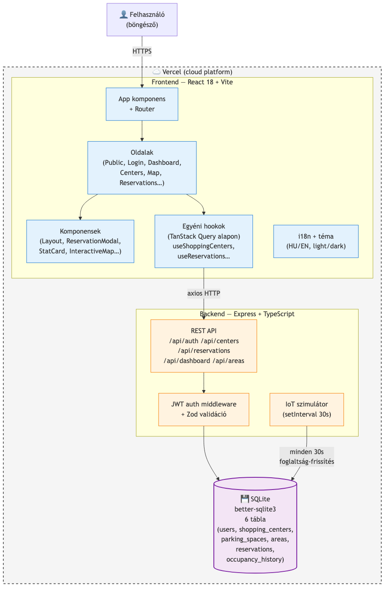

## 5.1. Frontend

A frontend rész egy React 18 alapú egyoldalas alkalmazás (SPA), amely a `src/main.tsx` belépési pontról indul. Az `App` komponens (`src/App.tsx`) tartalmazza a React Router beállítását, a `QueryClientProvider`-t (TanStack Query), a `ThemeProvider`-t (MUI téma), a `SnackbarProvider`-t (notistack toast-ok), valamint az i18next kontextusát. Az oldalak a `Layout` komponensbe ágyazódnak, amely az alkalmazás *vázát* (felső navigáció, oldalsáv, fő tartalom-terület) biztosítja.

A frontend kommunikál a backenddel az `axios` HTTP-kliens segítségével, az alábbi minta szerint:

1. A felhasználói akciónál (pl. modal megnyitása) az oldal-komponens hívja meg az egyéni hookot (pl. `useReservations`).
2. A hook a TanStack Query `useQuery` vagy `useMutation` API-jával egy axios-hívást küld a backend felé.
3. A TanStack Query automatikusan kezeli a betöltés, hiba és sikeres állapotot, valamint cache-eli az adatot.
4. A komponens a hook visszatérési értéke alapján a megfelelő állapotot rendereli ki (skeleton, hiba, üres, vagy a tényleges adat).

## 5.2. Backend

A backend egy Express alapú HTTP-szerver (`server/src/app.ts`), amely a `/api/*` útvonalakat szolgálja ki. A modul-szerkezet a következő:

- **`server/src/routes/`**: minden domain-területhez egy külön route-fájl tartozik (`auth.ts`, `shoppingCenters.ts`, `parkingSpaces.ts`, `areas.ts`, `reservations.ts`, `dashboard.ts`).
- **`server/src/auth/`**: a JWT-alapú hitelesítés középsora — `jwt.ts` (token aláírás/ellenőrzés) és `middleware.ts` (`requireAuth`, `requireRole`).
- **`server/src/db/`**: az adatbázis-kapcsolat (`client.ts`), a séma (`schema.ts`) és a kezdő adatok (`seed.ts`).
- **`server/src/simulator/`**: az IoT-szimulátor (`iot.ts`), amely 30 másodpercenként frissíti a foglaltsági adatokat.

A backend zárt egységként induláskor:

1. Megnyitja az SQLite-fájlt (vagy létrehozza, ha még nem létezik).
2. Lefuttatja a séma-DDL-eket (CREATE TABLE).
3. Ha az adatbázis üres, lefuttatja a seedet (5 mintaközpont, 50 parkolóhely, 5 zóna, és 2 alapértelmezett felhasználó: admin és visitor).
4. Elindítja az IoT-szimulátort.
5. Beindítja az HTTP-szervert a 3001-es porton.

## 5.3. Adatbázis

Az adatbázis SQLite, amely egyetlen fájlrendszerben tárolt fájlban (`server/data/parkvision.db`) él. A `better-sqlite3` driver szinkron, in-process kapcsolatot biztosít, ami azt jelenti, hogy minden SQL-művelet a Node.js fő szálon fut. Ez egyszerűbbé teszi a hibakezelést (nincsenek async/await callback-pyramid problémák), és bőven elegendő a tervezett terhelés (kis-közepes méretű deployment, néhány tucat egyidejű felhasználó).

A séma 6 táblát tartalmaz: `users`, `shopping_centers`, `parking_spaces`, `areas`, `reservations`, `occupancy_history`. A táblák részletes leírása a 8. fejezetben található.

## 5.4. Deployment

A produkciós környezetben a frontend a Vercel platformon (CDN-en) terjed, a backend pedig Vercel serverless függvényként vagy önálló Docker-konténerben fut. A két komponens ugyanazon domain mögött, eltérő útvonalakon érhető el (`/` → frontend, `/api/*` → backend). Az SQLite-fájl a serverless környezetben minden cold-start után újraépül a seed alapján; produkcióban ez a kompromisszum elfogadható, mert az adatok az IoT-szimulátorból folyamatosan újrarögzülnek. Egy valós deployment esetén az SQLite-ot egy hostolt megoldásra (pl. Turso, Supabase, vagy egy klasszikus PostgreSQL) lenne érdemes cserélni.

\newpage

# 6. Belső felépítés

A ParkVision belső felépítése két nagy egységre bomlik: a *frontend* (React SPA, `src/` mappa) és a *backend* (Express + SQLite, `server/` mappa). Mindkét rész TypeScript-ben íródott, és modulárisan szervezett. Ebben a fejezetben részletesen bemutatom mindkét rész belső szerkezetét.

## 6.1. Frontend komponensek

A React 18 *standalone* komponens-modelljét követve a felület újrahasználható, önálló komponensekből áll. A komponenseket két nagy csoportba sorolom: az *Oldal komponensek* (pages, `src/pages/`) azok, amelyekre a routing rendszerből navigálni lehet, a *Tiszta komponensek* (components, `src/components/`) pedig az újrahasználható felületi elemek, amelyeket az oldalak importálnak.

A ParkVision-ben az alábbi *Oldal komponensek* találhatók:

- **`PublicHomePage`**: a publikus kezdőoldal a hős szekcióval, térképpel és bevásárlóközpont-listával. A vendég felhasználók ide érkeznek először.
- **`LoginPage`**: a bejelentkezési oldal email és jelszó mezővel.
- **`DashboardPage`**: a bejelentkezett felhasználó vezérlőpultja KPI-kártyákkal és foglaltsági trenddiagramokkal.
- **`ShoppingCentersPage`**: a bevásárlóközpontok szűrhető listája adminoknak.
- **`ParkingDetailPage`**: egy adott bevásárlóközpont részletes oldala foglalási lehetőséggel.
- **`MapPage`**: teljes képernyős térkép az összes központtal.
- **`ReservationsPage`**: a felhasználó saját foglalásai két fülre bontva (közelgő, múlt).
- **`ParkingSpacesPage`**: a parkolóhelyek (parking spaces) admin tábla.
- **`AreasPage`**: a zónák (areas) admin oldala.
- **`AdminPage`**: admin elemző oldal részletes diagramokkal.
- **`SettingsPage`**: nyelvi és téma beállítások.

Az *Oldal komponensek* mellett az alábbi fontosabb *Tiszta komponensek* vannak:

- **`Layout`**: az oldalvázát biztosító komponens, amely tartalmazza a felső navigációs sávot, az oldalsávot és a fő tartalom-területet (`<Outlet />`).
- **`StatCard`**: a vezérlőpult KPI-kártyája. Címet, értéket, ikont és színkód-szegélyt jelenít meg, a `framer-motion` animációval kiegészítve.
- **`ShoppingCenterCard`**: egy bevásárlóközpontot reprezentáló kártya képpel, névvel, foglaltsági haladásjelzővel.
- **`ReservationModal`**: a parkolóhely-foglalási űrlap modal ablak.
- **`InteractiveMap`**: a Leaflet-térkép React-wrapper, amely a foglaltsági szint alapján színkódolja a markereket.
- **`EmptyState`**: az üres állapot egységes megjelenítése egy SVG-illusztrációval, címmel, leírással és opcionális akció-gombbal.
- **`ErrorBanner`**: a hibaüzenet egységes megjelenítése *Újrapróbálás* gombbal.
- **`ProtectedRoute`**: route-szintű jogosultság-ellenőrző wrapper, amely átirányít a `/login`-ra, ha nincs bejelentkezve felhasználó (vagy a szerepkör nem megfelelő).
- **`OfflineIndicator`**: kis sáv a felület tetején, ami megjelenik, ha a böngésző offline állapotba kerül.
- **`PWAInstallPrompt`**: a Progressive Web App telepítését ajánló modal.
- **`PageTransition`**: a felület közötti váltások animációs wrapper-je (framer-motion).
- **Skeleton komponensek** (`src/components/skeletons/`): `DashboardSkeleton`, `CardGridSkeleton`, `TableSkeleton` — a betöltési állapot vizuális helyőrzői.

## 6.2. Egyéni hookok

A TanStack Query-re épülő egyéni hookok (`src/hooks/`) szolgáltatják az adatlekérési logikát az oldalak számára:

- **`useShoppingCenters`**: lekéri az összes bevásárlóközpontot a `/api/shopping-centers` végpontról, 30 másodperces stale-time-mal.
- **`useParkingSpaces`**: lekéri egy adott központ parkolóhelyeit.
- **`useAreas`**: lekéri a zónákat.
- **`useReservations`**: kombinált hook, amely mind az olvasást, mind a létrehozást/lemondást támogatja. Bejelentkezett felhasználónál a backend API-t hívja, anonim felhasználónál a `localStorage`-be tárol.
- **`useAuth`**: a hitelesítési kontextust biztosító hook. Login, logout, token kezelés.
- **`usePWA`**: a Progressive Web App eseményeit (telepítés, frissítés, online/offline állapot) kezelő hook.

A `useReservations` egy érdekes példa a *kettős üzemmódra*: a hook első verziójában csak a `localStorage`-be tárolt foglalások voltak kezelve, mert a backend még nem létezett. A backend bekapcsolása után a hookot úgy alakítottam át, hogy bejelentkezett felhasználónál a `/api/reservations` REST-végpontot hívja, anonim felhasználónál pedig továbbra is a `localStorage`-t használja. Ez a duál mód lehetővé teszi, hogy a publikus oldalon is működjön a foglalás, mielőtt a felhasználó regisztrálna.

## 6.3. Routing

A felületek közötti navigáció kezelése a React Router 6-tal történik. A teljes routing fát a 6.1. ábra szemlélteti.

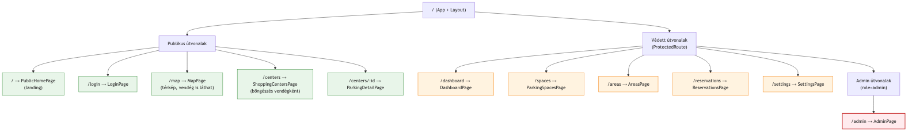

A `Routes` komponensben minden route egy `Route` elemet kap, amely meghatározza az URL-mintát és a renderelendő komponenst. A védett oldalakat a `ProtectedRoute` wrapper veszi körbe, amely ellenőrzi a `useAuth` kontextust, és ha nincs érvényes token, átirányít a `/login`-ra. Az admin-szerepkört igénylő oldalakat egy másodlagos ellenőrzés is védi: a `ProtectedRoute requireRole="admin"` propot fogad, és ha a token role-claim értéke nem `admin`, a felhasználó a `/dashboard`-ra kerül.

## 6.4. Backend route-ok

A backend `server/src/routes/` mappájában minden domain-területhez egy különálló Express router tartozik. A teljes backend végpont-szerkezet:

- **`auth.ts`**:
    - `POST /api/auth/login` — email + jelszó alapján JWT-t ad vissza.
    - `GET /api/auth/me` — a token alapján visszaadja az aktuális felhasználó adatait.
- **`shoppingCenters.ts`**:
    - `GET /api/shopping-centers` — az összes központ listája.
    - `GET /api/shopping-centers/:id` — egy központ részletei.
- **`parkingSpaces.ts`**:
    - `GET /api/parking-spaces?centerId=...` — egy központ parkolóhelyei.
    - `PATCH /api/parking-spaces/:id` — admin: státusz módosítás.
- **`areas.ts`**:
    - `GET /api/areas` — az összes zóna listája.
- **`reservations.ts`** (mind védett):
    - `GET /api/reservations` — a felhasználó saját foglalásai.
    - `POST /api/reservations` — új foglalás létrehozása.
    - `DELETE /api/reservations/:id` — foglalás lemondása.
- **`dashboard.ts`**:
    - `GET /api/dashboard/stats` — KPI-statisztikák.
    - `GET /api/dashboard/occupancy?centerId=...&hours=24` — foglaltsági idősor.

Minden route Zod sémával validálja a beérkező body-t (POST, PATCH végpontoknál), és a hibákat egységes JSON-formátumban (`{ message: string, code?: string }`) küldi vissza. A védett route-ok elejére `router.use(requireAuth)` middleware-t illesztettem be, ami biztosítja, hogy érvénytelen token esetén 401-es hiba érkezzen vissza.

## 6.5. IoT szimulátor

A `server/src/simulator/iot.ts` modul tartalmaz egy `setInterval`-alapú szimulátort, amely 30 másodpercenként lefut. Minden tick-en a következő történik:

1. Lekérdezi az összes bevásárlóközpont aktuális foglaltsági adatait.
2. Minden központra generál egy ±6 közötti random delta-t.
3. Az új foglaltság értékét a `[0, capacity]` intervallumra clamp-eli, így nem lehet negatív szám vagy a kapacitás feletti érték.
4. Frissíti a `shopping_centers` tábla `occupied` és `updated_at` mezőit.
5. Új bejegyzést rögzít az `occupancy_history` táblába a vizsgálatokhoz.

Ez a megközelítés azt szimulálja, ahogy egy valódi IoT-szenzor-rendszer (pl. a parkolóhelyek alá telepített induktív hurkok vagy kamerás rendszer) folyamatosan jelentené a foglaltsági adatokat. Egy valódi rendszerre váltáshoz mindössze egyetlen modult (a `iot.ts`-t) kell lecserélni egy MQTT-vagy webhook-alapú modulra.

\newpage

# 7. Biztonság

A ParkVision biztonsági modellje több rétegű: a *hitelesítés* (authentication) a JWT-tokenekkel, a *jogosultságkezelés* (authorization) a szerepkörökkel, a *bemenet-validáció* a Zod-sémákkal, a *jelszótárolás* a bcrypt-tel, és az *általános biztonsági baseline* a CORS-szal és a HTTP-headerek megfelelő kezelésével történik.

## 7.1. JWT-alapú hitelesítés

A bejelentkezést a `POST /api/auth/login` végpont szolgálja ki. A felhasználó email-jelszó párosát a backend a `users` tábla `password_hash` mezője alapján ellenőrzi a `bcrypt.compareSync` függvénnyel. Sikeres ellenőrzés esetén a `signToken` függvény (`server/src/auth/jwt.ts`) JWT-tokent állít elő a felhasználó alapadatainak (id, email, név, szerepkör) bele-csomagolásával. A token érvényessége 7 nap, az aláírókulcs a `JWT_SECRET` környezeti változóban található.

A frontend a kapott tokent a `localStorage`-ben tárolja, és minden szerver-irányú HTTP-kérésnél a `Authorization: Bearer <token>` headerben küldi el. A `requireAuth` middleware (`server/src/auth/middleware.ts`) minden védett végpontnál ellenőrzi a token érvényességét: ha hiányzik vagy lejárt, 401-es hibát küld vissza.

## 7.2. Szerepkör-alapú jogosultságkezelés (RBAC)

A rendszer két szerepkört támogat: `admin` és `visitor`. A `requireRole` middleware ellenőrzi a token role-claim értékét, és csak akkor enged tovább, ha az megegyezik a megadott szerepkörrel — vagy ha a felhasználó admin (mert az admin minden joggal rendelkezik). Ez a hierarchia leegyszerűsíti a jogosultságkezelést, és lehetővé teszi a jövőbeli bővítést (pl. `operator` szerepkör hozzáadása az admin alá).

A 7.1. táblázat foglalja össze, hogy melyik szerepkör milyen műveleteket végezhet:

| Művelet | Vendég | Visitor (regisztrált) | Admin |
|---|:---:|:---:|:---:|
| Központok böngészése | ✓ | ✓ | ✓ |
| Térkép megtekintése | ✓ | ✓ | ✓ |
| Saját foglalás létrehozása | – | ✓ | ✓ |
| Saját foglalás lemondása | – | ✓ | ✓ |
| Vezérlőpult megtekintése | – | – | ✓ |
| Parkolóhely státusz módosítása | – | – | ✓ |
| Zóna kezelése | – | – | ✓ |
| Admin panel | – | – | ✓ |

*7.1. táblázat: Erőforrásokhoz való hozzáférési mátrix.*

## 7.3. Bemenet-validáció Zod-dal

Minden POST és PATCH végpont a beérkező JSON-t Zod-sémával validálja. Ez a megközelítés egyszerre több célt szolgál:

- **Típusbiztonság**: a Zod-séma egyúttal TypeScript-típust is generál, így a kódban nem kell külön `unknown`-ról `unknown`-ra kasztolni.
- **Védelem rosszindulatú bemenettől**: ha a kliens szándékosan hibás formátumot küld (pl. SQL-injection kísérlet, túl hosszú string), a Zod azonnal eldobja a kérést 400-as hibával.
- **Egyértelmű hibaüzenet**: a `parse.error.issues` tömb pontosan megmondja, melyik mező mit hibázott el.

Például a foglalás-létrehozás sémája:

```typescript
const CreateSchema = z.object({
  centerId: z.string().min(1),
  slotStart: z.string().datetime(),
  slotEnd: z.string().datetime(),
});
```

A séma garantálja, hogy a `centerId` nem üres, és hogy a két időbélyeg ISO 8601-formátumban van. Az ezen túli logikai validációk (slot a múltban, központ telített, duplikált foglalás) a route-handlerben történnek külön ellenőrzéssel.

## 7.4. Jelszótárolás bcrypt-tel

A felhasználói jelszavak soha nem tárolódnak nyílt formátumban. A regisztráció során (a kezdeti seed-elésben) a `bcrypt.hashSync(password, 10)` függvény generálja a hash-t, ami 10 körrel (saltrounds) erősíti meg a jelszót. A 10 saltround-os választás a bcrypt-közösség által ajánlott alapérték, amely körülbelül 100 ms-os hash-elési időt eredményez modern hardveren — elég gyors, hogy ne lassítsa a bejelentkezést, de elég lassú, hogy a brute-force támadások ne legyenek életképesek.

## 7.5. Frontend-szintű biztonság

A frontend oldalon a `ProtectedRoute` komponens biztosítja, hogy a védett URL-eket csak bejelentkezett felhasználók érhessék el. Ha valaki közvetlenül beírja az URL-t a böngészőbe, a `ProtectedRoute` ellenőrzi a `useAuth` kontextust, és átirányít a `/login`-ra, ha nincs érvényes token. Ez azonban *kizárólag UX-szintű* védelem — a tényleges biztonsági ellenőrzés mindig a backenden történik (a `requireAuth` middleware-en keresztül).

A felhasználói űrlapokon (login, foglalás) inline validáció van: a *Megerősítés* gomb tiltott állapotba kerül, ha a felhasználó nem tölti ki az összes mezőt, vagy ha a kitöltött adatok nem helyesek (pl. múltbéli időpont). Ez a kliens-szintű validáció kényelmi szolgáltatás, és nem helyettesíti a backend validációt.

## 7.6. CORS és HTTP-headerek

A backend Express-szerver a `cors` middleware-rel engedélyezi a frontend domain-ről érkező kéréseket. Produkciós környezetben a `CORS_ORIGIN` környezeti változó határozza meg az engedélyezett domaint (pl. `https://szakdolgozat-chi.vercel.app`); fejlesztés alatt minden origin engedélyezve van.

## 7.7. Titkok kezelése

A repo-ban *semmilyen titok* (JWT-secret, adatbázis-jelszó, API-kulcs) nem szerepel. A környezeti változók a `.env.example` fájlban dokumentáltan vannak (sablon nélküli értékekkel), és a tényleges értékek a Vercel platform titkok-tárolójában (`vercel env`) vannak rögzítve. A CI/CD a GitHub Actions secrets-ből veszi a deploy-tokent.

\newpage

# 8. Adatmodell

Az adatok eltárolásához egy SQLite adatbázist használtam, amelyhez a Node.js oldalról a `better-sqlite3` driver biztosítja a hozzáférést. A választás indoklása a 4.7. fejezetben található. A teljes adatbázis-séma a `server/src/db/schema.ts` fájlban van definiálva, és induláskor automatikusan létrehozódik, ha még nem létezik. A 8.1. ábra mutatja be a hat tábla közötti kapcsolatokat.

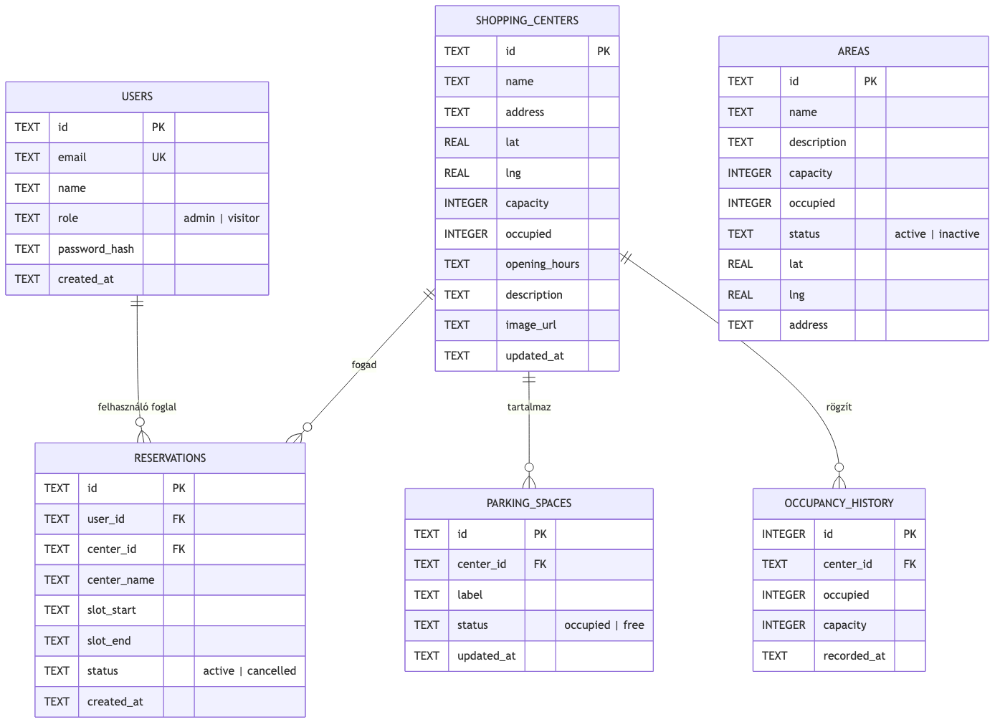

## 8.1. Felhasználó (users)

A `users` tábla a regisztrált felhasználók adatait tárolja. A *primary key* az `id` (UUID-string), és az `email` mező egyedi (`UNIQUE`), így nem lehet két fiók ugyanazzal az email-címmel. A `role` mező két érték közül vehet fel: `admin` vagy `visitor`. A jelszó nem nyíltan, hanem bcrypt-hash formájában tárolódik a `password_hash` mezőben. Az alapértelmezett seed-felhasználók (`admin@parkvision.hu` és `visitor@parkvision.hu`) a `server/src/db/seed.ts`-ben vannak rögzítve.

## 8.2. Bevásárlóközpont (shopping_centers)

A `shopping_centers` tábla a rendszerbe felvett bevásárlóközpontok adatait tartalmazza. A földrajzi koordinátákat a `lat` és `lng` mezők (REAL típusban) rögzítik a Leaflet-térképhez. A `capacity` az összes parkolóhely-mennyiség, az `occupied` pedig a pillanatnyi foglaltság — ezt frissíti folyamatosan az IoT-szimulátor. A `description` és az `image_url` opcionális szöveges mezők, amelyeket a publikus felület a részletes oldalon jelenít meg.

## 8.3. Parkolóhely (parking_spaces)

A `parking_spaces` tábla az egyes parkolóhelyek (férőhelyek) szintjén tárolja az állapotot. Minden parkolóhely egy bevásárlóközponthoz tartozik (`center_id` idegen kulcs, ON DELETE CASCADE). A `label` egy emberi olvasható azonosító (pl. „A12"), a `status` pedig `occupied` vagy `free` lehet. A tábla az adminisztratív felület számára releváns: lehetővé teszi az egyes férőhelyek külön kezelését (pl. szervizelés miatti zárolás).

## 8.4. Zóna (areas)

A `areas` tábla a bevásárlóközpontokon *belüli* zónákat (családi, mozgáskorlátozott, e-töltő, stb.) képviseli. Minden zónának van saját `capacity` és `occupied` értéke, valamint egy `status` mező (`active` vagy `inactive`). A zóna kapcsolódhat egy földrajzi koordinátához is (`lat`, `lng`), bár a jelenlegi MVP-ben ez opcionális. A jövőbeli tervek között szerepel, hogy a zóna a `shopping_centers` táblához is FK-val kötődjön, jelenleg ez a kapcsolat azonban a tervezési fázisban szándékosan kihagyva.

## 8.5. Foglalás (reservations)

A `reservations` tábla a felhasználói foglalásokat tárolja. Minden foglalás egy felhasználóhoz (`user_id`) és egy bevásárlóközponthoz (`center_id`) kapcsolódik, mindkettő `ON DELETE CASCADE` viselkedéssel. A `slot_start` és `slot_end` mezők ISO 8601 formátumú időbélyegek. A `status` mező `active` vagy `cancelled` lehet — fizikai törlés helyett *soft delete*-tel dolgozok, mert a múltbeli adatok elemzése (pl. lemondási arány) is releváns lehet a jövőben. A `created_at` mezőt használom a foglalások időrendbeli rendezéséhez.

## 8.6. Foglaltsági előzmények (occupancy_history)

A `occupancy_history` táblába minden IoT-szimulátor tick-nél új sor kerül be (egy sor / központ / tick). Az `id` itt nem UUID, hanem `INTEGER PRIMARY KEY AUTOINCREMENT`, mert a tábla gyorsan nő, és az automatikus növekedés egyszerűbb mint UUID-k generálása. A tábla a vezérlőpult idősoros diagramjához nyújt nyersanyagot: a `dashboard.ts` route a `recorded_at` szerinti időablakra (pl. utolsó 24 óra) lekérdezi a központ adatait.

## 8.7. Indexek

Az adatbázis három fontos indexet hoz létre induláskor:

- **`idx_reservations_user`**: a `reservations(user_id)` mezőre, mert a `GET /api/reservations` endpoint ezzel szűri a felhasználó foglalásait.
- **`idx_reservations_center`**: a `reservations(center_id)` mezőre.
- **`idx_occupancy_center_time`**: a `occupancy_history(center_id, recorded_at)` mezőkre — ez egy összetett index a vezérlőpult-lekérdezés gyorsítására.

Az indexek nélkül az SQLite teljes táblabejárást végezne, ami a `occupancy_history` tábla növekedésével (napi 30 másodpercenkénti 5 sor = napi 14.400 sor) hamar érzékelhető lassulást okozna.

\newpage

# 9. A rendszer magas szintű folyamatai

A rendszerben két olyan folyamat van, amely kiemelten fontos: a *foglalás létrehozása* (felhasználói akció) és az *IoT-szimulátor foglaltság-frissítés* (háttér-folyamat). Ebben a fejezetben mindkét folyamatot szekvencia diagrammal és prózával mutatom be.

## 9.1. Foglalás létrehozása

Egy új foglalás létrehozása a felhasználó oldaláról egy egyszerű interakció, de a hátterében több réteg dolgozik együtt. A 9.1. ábra mutatja be a folyamat lépéseit.

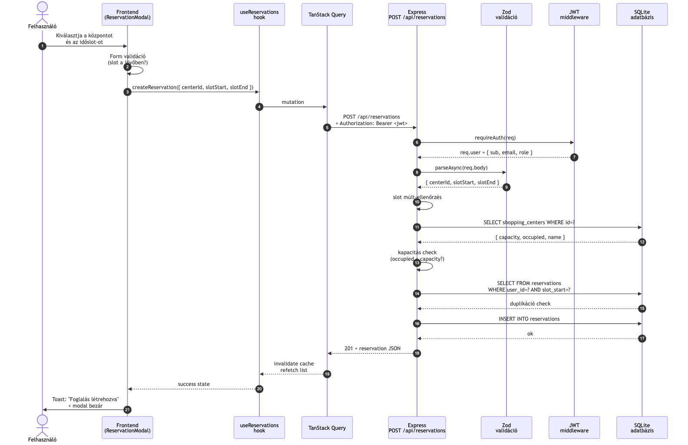

A folyamat a felhasználó oldaláról a `ReservationModal` komponens megnyitásával indul. A felhasználó kiválasztja a kezdési és befejezési időpontot, majd megnyomja a *Megerősítés* gombot. A komponens először saját szintű inline validációt végez: ellenőrzi, hogy a kezdési időpont a jövőben van-e. Ha nem, a *Megerősítés* gomb tiltott állapotú marad, és inline hibaüzenet jelenik meg.

Ha a kliens-szintű validáció sikerült, a komponens meghívja a `useCreateReservation` hookot, amely a TanStack Query `useMutation` API-ját használja. A mutation a `POST /api/reservations` végpontra küld egy axios-kérést, a `Authorization: Bearer <jwt>` headerrel.

A backend első lépése a `requireAuth` middleware: kicsomagolja a tokent, és a `req.user` objektumba helyezi a felhasználói claim-eket. Ezt követi a Zod-séma alapú validáció: a `centerId`, `slotStart` és `slotEnd` mezők formátum-ellenőrzése. Sikeres validáció után a route-handler három üzleti szabályt ellenőriz:

1. A slot a *múltban* van-e? Ha igen, 422-es `past` hibakódot ad vissza.
2. A bevásárlóközpont *létezik-e*? Ha nem, 404-es hibát.
3. A központ *telített-e* (occupied >= capacity)? Ha igen, 409-es `full` hibát.
4. A felhasználó *foglalt-e már* erre a slotra? Ha igen, 409-es `duplicate` hibát.

Ha mind a négy ellenőrzés zöld, a foglalás belekerül az adatbázisba egy `INSERT INTO reservations` SQL-kérdéssel. A backend a létrejött foglalást 201-es státusszal és a JSON-objektummal küldi vissza.

A frontend a sikeres válasz után a TanStack Query cache-t invalidálja (`queryClient.invalidateQueries`), ami automatikusan újra-lekérdezteti a felhasználó foglaláslistáját. A felhasználó egy *Foglalás létrehozva* toast üzenetet lát, és a modal bezárul.

## 9.2. IoT foglaltság-frissítés

A háttérben futó IoT-szimulátor minden 30 másodpercben frissíti a bevásárlóközpontok foglaltsági adatait. A 9.2. ábra mutatja be a folyamatot.

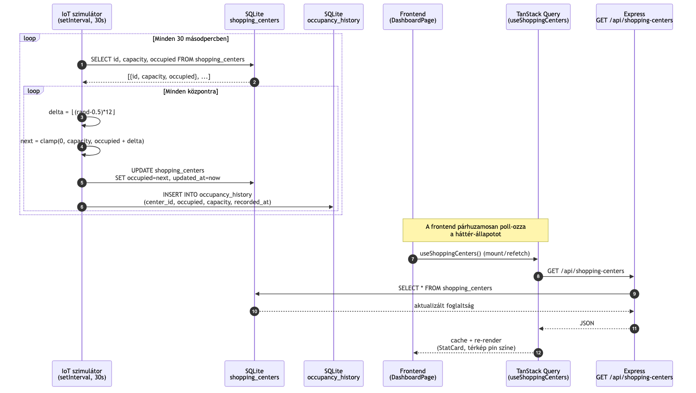

A `setInterval` minden tick-nél meghívja a `tick()` függvényt a `simulator/iot.ts`-ben. A függvény először lekérdezi az összes bevásárlóközpont aktuális adatait egy `SELECT id, capacity, occupied FROM shopping_centers` lekérdezéssel. Ezután minden központra a következőket csinálja:

1. Generál egy random delta-t a `[-6, +6]` intervallumon: `delta = ⌊(Math.random() - 0.5) * 12⌋`.
2. Az új foglaltságot `[0, capacity]` intervallumra clamp-eli: `next = max(0, min(capacity, occupied + delta))`.
3. Frissíti a `shopping_centers` tábla `occupied` és `updated_at` mezőit.
4. Új sort rögzít az `occupancy_history` táblába a vizsgálatokhoz.

A frontend ezzel párhuzamosan a vezérlőpult-oldalon a `useShoppingCenters` hookkal periódikusan újra-lekérdezi a központok adatait (a TanStack Query `staleTime` paraméterével szabályozva). Amikor új adat érkezik, a `StatCard` és az `InteractiveMap` komponensek automatikusan újrarenderelődnek, így a felhasználó a frissített foglaltsági adatokat látja anélkül, hogy az oldalt manuálisan újra kellene tölteni.

\newpage

# 10. Fontosabb kódrészletek

Ebben a fejezetben a rendszer három legkomplexebb funkciójának kódját mutatom be: a JWT-alapú bejelentkezést, a foglalás-létrehozási validációt, és az IoT-szimulátort. Mindegyik kódrészletet rövid magyarázattal egészítettem ki.

## 10.1. JWT-alapú bejelentkezés

A bejelentkezés a `server/src/routes/auth.ts` fájlban van implementálva. A teljes függvény a következő:

```typescript
router.post('/login', (req, res) => {
  const parsed = LoginSchema.safeParse(req.body);
  if (!parsed.success) {
    return res.status(400).json({ message: 'Invalid email or password format' });
  }
  const { email, password } = parsed.data;
  const db = getDb();
  const row = db
    .prepare('SELECT id, email, name, role, password_hash FROM users WHERE lower(email) = lower(?)')
    .get(email);
  if (!row) {
    return res.status(401).json({ message: 'Hibás email cím vagy jelszó' });
  }
  if (!bcrypt.compareSync(password, row.password_hash)) {
    return res.status(401).json({ message: 'Hibás email cím vagy jelszó' });
  }
  const token = signToken({ sub: row.id, email: row.email, role: row.role, name: row.name });
  return res.json({
    token,
    user: { id: row.id, email: row.email, name: row.name, role: row.role },
  });
});
```

A függvény elsőként Zod-dal validálja a bejövő body-t. A felhasználót kis-és-nagybetű érzéketlenül keresi az adatbázisban (`lower(email)`), ami megakadályozza, hogy a felhasználó *`Admin@parkvision.hu`* és *`admin@parkvision.hu`* között különbséget tegyen. Fontos *security* részlet: ha a felhasználó nem létezik, ugyanazt az `Hibás email cím vagy jelszó` üzenetet adjuk vissza, mint ha a jelszó hibás lenne — így a támadó nem tudja egyszerűen leellenőrizni, hogy egy email cím regisztrálva van-e. A bcrypt-összehasonlítás konstans időben fut, így nem ad támadhatósági információt sem.

## 10.2. Foglalás-létrehozási validáció

A foglalás létrehozása a `server/src/routes/reservations.ts` fájlban található. A négy üzleti szabály validációja:

```typescript
router.post('/', (req, res) => {
  const parsed = CreateSchema.safeParse(req.body);
  if (!parsed.success) {
    return res.status(400).json({ message: 'Invalid reservation payload' });
  }
  const { centerId, slotStart, slotEnd } = parsed.data;
  const start = new Date(slotStart).getTime();

  // 1. Múltbeli időpont ellenőrzés
  if (start <= Date.now()) {
    return res.status(422).json({ code: 'past', message: 'A választott időslot a múltban van.' });
  }

  // 2. Központ létezésének ellenőrzése
  const db = getDb();
  const center = db.prepare('SELECT id, name, capacity, occupied FROM shopping_centers WHERE id = ?').get(centerId);
  if (!center) return res.status(404).json({ message: 'Shopping center not found' });

  // 3. Telítettség ellenőrzés
  if (center.occupied >= center.capacity) {
    return res.status(409).json({ code: 'full', message: 'A központ jelenleg telített.' });
  }

  // 4. Duplikáció ellenőrzés
  const duplicate = db.prepare(
    'SELECT id FROM reservations WHERE user_id = ? AND center_id = ? AND slot_start = ? AND status = ?'
  ).get(req.user!.sub, centerId, slotStart, 'active');
  if (duplicate) {
    return res.status(409).json({ code: 'duplicate', message: 'Erre az időslotra már van foglalásod.' });
  }

  // Beillesztés
  const reservation = { /* ... */ };
  db.prepare('INSERT INTO reservations (...) VALUES (...)').run(/* ... */);
  return res.status(201).json(rowToReservation(reservation));
});
```

A négy ellenőrzés egymás utáni sorrendje *fontos*: először a kliens által megadott adatok logikai helyességét (1. múlt, 2. létező központ), majd az adatbázis-szintű korlátozásokat (3. kapacitás, 4. duplikáció) ellenőrzöm. Ezzel a sorrenddel a leggyakoribb hibák (felhasználói tévedés) a leggyorsabban kapnak választ, és csak a komplexebb ellenőrzések érintik az adatbázist.

A `code` mező a hibaválaszban segít a frontendnek, hogy a megfelelő üzenetet jelenítse meg: `past` esetén inline validációs hibát, `full` esetén figyelmeztető toast-ot, `duplicate` esetén pedig egy „már lefoglaltad" üzenetet.

## 10.3. IoT szimulátor

A szimulátor a `server/src/simulator/iot.ts`-ben található:

```typescript
import { getDb } from '../db/client';

const TICK_MS = Number(process.env.IOT_TICK_MS || 30_000);
let timer: NodeJS.Timeout | null = null;

function tick(): void {
  const db = getDb();
  const centers = db.prepare('SELECT id, capacity, occupied FROM shopping_centers').all();
  const update = db.prepare('UPDATE shopping_centers SET occupied = ?, updated_at = ? WHERE id = ?');
  const recordHistory = db.prepare(
    'INSERT INTO occupancy_history (center_id, occupied, capacity, recorded_at) VALUES (?, ?, ?, ?)'
  );
  const now = new Date().toISOString();
  for (const c of centers) {
    const delta = Math.floor((Math.random() - 0.5) * 12);
    const next = Math.max(0, Math.min(c.capacity, c.occupied + delta));
    update.run(next, now, c.id);
    recordHistory.run(c.id, next, c.capacity, now);
  }
}

export function startSimulator(): void {
  if (timer) return;
  timer = setInterval(tick, TICK_MS);
  console.log(`[iot] occupancy simulator started (tick ${TICK_MS}ms)`);
}
```

A modul a `prepare` minta segítségével kétszer-felhasználható *prepared statement*-eket hoz létre, amelyek minden tick-nél optimálisan futnak. A `Math.random() - 0.5` egy `[-0.5, 0.5)` intervallumú értéket ad, amit 12-vel szorozva és lekerekítve `[-6, 5]` intervallumra konvertál. A `Math.max(0, Math.min(c.capacity, c.occupied + delta))` clamp megakadályozza, hogy a foglaltság negatív vagy a kapacitásnál nagyobb legyen.

Az érdekesség, hogy a tick-időt környezeti változóval konfigurálható (`IOT_TICK_MS`), így a tesztkörnyezetben gyorsabb (pl. 100 ms) frissítéssel lehet a változásokat ellenőrizni.

## 10.4. ProtectedRoute komponens

A frontend oldalon a védett útvonalak biztosítása a `ProtectedRoute` komponensben történik:

```tsx
export function ProtectedRoute({ children, requireRole }: ProtectedRouteProps) {
  const { isAuthenticated, user } = useAuth();
  if (!isAuthenticated) {
    return <Navigate to="/login" replace />;
  }
  if (requireRole && user?.role !== requireRole && user?.role !== 'admin') {
    return <Navigate to="/dashboard" replace />;
  }
  return <>{children}</>;
}
```

A komponens először ellenőrzi, hogy van-e bejelentkezett felhasználó. Ha nincs, átirányít a `/login`-ra. Ha igen, és a komponens `requireRole` propot kapott (pl. `admin`), ellenőrzi, hogy a felhasználó szerepkör-claim-je megfelel-e. Az admin minden szerepkört „lefed", így admin felhasználó minden védett oldalt elér. A `replace` prop azt jelenti, hogy az átirányítás nem írja be magát a böngészőelőzményekbe, így a *vissza* gomb nem hozza vissza a felhasználót egy olyan oldalra, ahova nincs jogosultsága.

\newpage

# 11. Tapasztalatok, továbbfejlesztési lehetőségek

A szakdolgozatom elkészítése előtt már tisztában voltam azzal, hogy a frontenden React-et és TypeScript-et fogok használni, mert ezekkel az eszközökkel már korábban foglalkoztam, és a könyvtárak ekoszisztémája olyan kiforrott, hogy egy MVP-szintű alkalmazás építésére kifejezetten alkalmas. A backend-kérdés viszont nyitott volt: kezdetben azt terveztem, hogy a perzisztenciát csak a `localStorage`-ben oldom meg, és nem építek saját szervert. A korai sprintek során világossá vált, hogy ez a megközelítés komolyan korlátozza a projekt termékminőségi értékét — például nem mutatható be a JWT-alapú hitelesítés, vagy a több felhasználós foglalási rendszer. Ezért úgy döntöttem, hogy egy minimális, de valós Express-szervert is építek SQLite adatbázissal.

A fejlesztés első lépéseként a Sprint 01-es kutatási fázisban összeállítottam a tervezett tech stack-et, és architekturális döntési naplókat (ADR) írtam a kritikus választásokról: frontend platform, IaC stratégia, foglalás-perzisztencia, backend stack, hitelesítési mód, és deploy stratégia. Ezek a döntések visszaolvashatók a `sprints/02/docs/adr/` mappában. Az ADR-ek vezetése volt számomra az egyik legfontosabb tanulság: bár első ránézésre extra adminisztratív teher, később, amikor egy döntéshez vissza kellett térni („miért is használunk localStorage-t a szerver helyett?"), a decision-naplók azonnali választ adtak.

A képernyőtervek elkészítését viszonylag későn (a kódolás után) végeztem el, mert a Material-UI komponens-könyvtárral a felület gyorsan iterálható volt. Visszanézve azt gondolom, hogy egy korai, akár ASCII-szintű wireframe-elés is rengeteg időt megspórolt volna — a `sprints/02/wireframes/` mappában található leírások jó alapnak bizonyultak, de ezek is csak a Sprint 02 második felében készültek el.

A foglalási flow tervezése volt a legkomplexebb feladat. A négy üzleti szabály (slot a múltban, központ telített, duplikáció, hiányzó központ) együttes ellenőrzése trükkös volt, főleg azért, mert a frontend `useReservations` hookja két üzemmódban működik: anonim (localStorage) és hitelesített (backend). A két módot úgy egységesítettem, hogy a hibaüzenetek formátumát (kód + szöveges üzenet) mindkét oldalon ugyanazzá tettem, így a UI-komponens nem érzékeli a különbséget.

A tesztelés terén a Vitest + React Testing Library kombinációja kiválóan bevált. Az MSW (Mock Service Worker) különösen hasznos volt az integrációs teszteknél: a tesztben *valódi* HTTP-kéréseket küldök, amelyeket az MSW interceptál, és így a TanStack Query teljes életciklusa (loading, error, success, cache) valósághűen tesztelhető. A 54 teszt összesen kb. 8 másodperc alatt fut le, ami a kontinuitás-folyamatot (CI) is gyorsan tartja.

Az IoT-szimulátor egy szándékosan egyszerű, de pedagogikailag fontos építő része a rendszernek. A 30 másodperces tick és a `[-6, +6]` intervallumú random delta tipikus értékek, amelyek vizuálisan érzékelhető, de nem zavaró foglaltsági ingadozást generálnak. A szimulátor élesben (production-ban) is fut, és a vezérlőpult diagramja látványosan mutatja, ahogy a foglaltság percenként változik.

## 11.1. Mit nem sikerült megvalósítani

A Sprint 02-es leadásban néhány funkció szándékosan kimaradt a hatókörből, vagy időhiány miatt csak részben készült el:

- **Valódi értékelési vagy visszajelzési rendszer** a felhasználók számára (pl. „Sikerült-e a parkoláskor szabad helyet találni?"). Ez egy értékes adatforrás lenne a foglaltsági becslés finomhangolásához, de a Sprint 02-be már nem fért bele.
- **Push-értesítések** a foglaltsági szint közeledésekor (pl. „A te foglalásod időpontjában a központ várhatóan 92%-os foglaltságon lesz"). A Web Push API integrációja egy önálló sprint-feladat.
- **Fizetési integráció** a foglalások megerősítésére. Ezt a funkciót az MVP-ben szándékosan kihagytam, mert a célom az volt, hogy a foglalási flow-t üzleti-fizetési kérdések nélkül validáljam.
- **End-to-end (E2E) tesztek** Playwright-tal. A csomag fel van készítve (`@playwright/test`), de a tényleges tesztek megírására már nem maradt idő. Ez az egyik első Sprint 03-ban végrehajtandó feladat.

## 11.2. Továbbfejlesztési lehetőségek

A rendszer jelenleg az alkalmas alapot biztosítja, hogy egy valós produkciós környezetbe továbbfejlesszük. Több irány is járható:

**Mobil natív alkalmazás**: a React Native vagy az Ionic keretrendszerrel viszonylag kis ráfordítással egy iOS/Android natív alkalmazás építhető a meglévő backend-re. A natív app jelentősen javítaná a felhasználói élményt útközben (push-értesítések, gyorsabb indulás, offline tárolás, integráció a navigációs alkalmazásokkal).

**Valós szenzor-integráció**: az `iot.ts` szimulátort egyetlen MQTT-vagy webhook-alapú modulra cserélve a rendszer azonnal képes lesz valós szenzorok (induktív hurkok, kamerás rendszer) adatait fogadni. Az adatbázis-séma ezt már most támogatja, mert az `occupancy_history` tábla bármilyen forrásból érkező értéket képes tárolni.

**Foglaltsági előrejelzés gépi tanulással**: a `occupancy_history` tábla idősoros adatai alapján egy egyszerű regressziós modell (pl. ARIMA vagy egy könnyű neurális háló) képes lenne megjósolni a következő 1-2 órás foglaltsági trendet. Ez kifejezetten hasznos lenne a foglalási flow-ban: a felhasználó a slot kiválasztásakor látná, hogy mire fog érkezni 80%-os vagy 95%-os foglaltsággal kell-e számolnia.

**Multi-tenant rendszer**: a jelenlegi rendszer egyetlen üzemeltetőre van kalibrálva. Egy nagyobb deployment esetén szükségessé válhat, hogy több *tenant* (több bevásárlóközpont-üzemeltető) párhuzamosan használja a rendszert, mindegyik a saját adataival és felhasználóival. Az adatbázis-séma némi módosítást igényelne (`tenant_id` mező hozzáadása), és az auth réteget tenant-szintű elszigeteléssel kellene bővíteni.

**Térképi navigáció és sorompó-vezérlés**: a sikeres foglalás után a felhasználót az alkalmazás közvetlenül a Google Maps-en vagy a Waze-en keresztül navigálhatná a célhoz. Egy lépéssel előrébb pedig a Parkl-modellt követve a sorompók nyitása QR-kóddal vagy rendszámfelismeréssel automatizálható lenne.

**Adminisztratív riportok**: a vezérlőpult jelenleg élő adatokat mutat, de havi/heti összesítő riportok (PDF vagy Excel exporttal) hiányoznak. Ez egy jól körülhatárolt, könnyen végrehajtható következő feladat.

Összességében úgy gondolom, hogy egy olyan rendszert sikerült létrehoznom, amely a saját definiált hatókörén belül **release-közeli** állapotban van: működik, telepítve van, tesztekkel lefedett, és a kódbázis jól dokumentált. A Sprint 03-ban a fenti továbbfejlesztések közül néhányat magam is implementálni szeretnék.

\newpage

# 12. Mesterséges intelligencia használata a fejlesztés során

A ParkVision teljes életciklusában — a kezdeti tervezéstől a kódoláson és teszteléseken át a dokumentáció megírásáig — több mesterséges intelligencia (MI) eszközt is használtam. A folyamatot tudatosan dokumentáltam, hogy a használat átlátható és visszakövethető legyen. Ebben a fejezetben az MI-eszközök használatát öt szempont szerint mutatom be: használt eszközök, konkrét feladatok, validáció, hol *nem* használtam MI-t, és mit tanultam a folyamatból.

## 12.1. Felhasznált eszközök

A projekt során több MI-eszközt használtam, mindegyiket más fázisban és más célra:

- **Claude Code (Opus 4.7)**: a fejlesztés *karmestere*. Egy IDE-integrált, agentikus parancssori eszköz, amely fájlokat tud olvasni, írni, és parancsokat futtatni. Az architekturális döntések, a sprint-leadandó dokumentumok (ADR-ek, user storyk, traceability matrix) és a foglalási feature teljes vertikális szelete (`useReservations` hook, `ReservationModal`, `ReservationsPage`, és tesztek) ezzel készült. A választás indoka az volt, hogy a párhuzamos `Explore` subagent-mintázattal egyszerre több területet is fel tudtam térképezni a kódbázisban, ami a refaktorhoz és a hiányosságok azonosításához (pl. a `EmptyState` komponens hiányzó SVG-illusztrációja) elengedhetetlen volt.

- **GitHub Copilot**: sor-szintű kódkiegészítés (autocomplete) a JSX-ben és a tesztekben. A választás indoka az volt, hogy a Material-UI ismétlődő prop-jai, az i18n-kulcsok ismétlése, és a Gherkin acceptance-tesztek Given-When-Then sablonjai esetén jelentős időmegtakarítást nyújt.

- **ChatGPT (GPT-5)**: nehezebb területeken (pl. Leaflet konfiguráció finomhangolás, Recharts API-kérdések), és olyan szövegezési feladatoknál használtam, ahol egy második modell véleménye perspektívát adott a Claude Code megoldásaihoz képest.

- **Gemini 2.5 Pro**: a Sprint 01 kutatási fázisában egy alkalommal használtam, a tech-stack összehasonlító táblázatának generálására (CRA vs. Vite vs. Next.js). A kimenetet kézzel jelentősen átírtam, mert a generált tartalom egyes részei elavult információt tartalmaztak.

## 12.2. Konkrét feladatok, ahol MI-t használtam

**Kódgenerálás**: a `ReservationModal`, `ReservationsPage`, `useReservations` hook első verzióit Claude Code-dal generáltam, majd inkrementálisan finomhangoltam. A `EmptyState` komponens SVG-illusztrációit (parkolási marker + üres rács) szintén MI-vel terveztem meg, hogy a stock Material-UI ikonok helyett brand-specifikus vizuál legyen. A skeleton-komponensek (`DashboardSkeleton`, `CardGridSkeleton`, `TableSkeleton`) a meglévő MUI Skeleton API-ra épülő MI-generált variánsok.

**Refaktorálás és kódreview**: a `StatCard` komponenst MI segítségével refaktoráltam: a régi „lapos" Material Card-ból gradient hátterű, accent-szegélyű, trend-ikonos és hover-animációval ellátott változatra. A `Layout` sidebar aktív-link kiemelés és a drawer mikro-animációja is MI-javasolt minta, amit kézzel hangoltam a teal/orange brand-arculatra.

**Architektúra-tervezés**: a foglalás-perzisztencia kérdésénél (localStorage vs. localforage vs. MSW state) egy strukturált trade-off táblázatot generáltam Claude Code-dal, amely végül az ADR-0003 alapja lett. A 3-sprintes ütemterv (ápr. 26 / máj. 3 / máj. 23.) interaktív brainstorming session-ben született, ahol az MI multiple-choice kérdéseket tett fel a hatókör, a sablon és a feature-prioritás tisztázására — ez vezetett a „maximális push" + „polish + 1 új feature" döntéshez.

**Hibakeresés**: egy `notistack` v3 + MUI v5 kompatibilitási problémát Claude Code segítségével terveztünk meg (verzió-pin, provider-elhelyezés), és a futtatás megerősítette a választást. A TypeScript szigorú módban felmerült hibák (pl. `act` import, `JSX.Element` típus-elavulás) MI-támogatottan diagnosztizálódtak.

**Dokumentáció**: a 8 INVEST user story, a 6 ADR, a Definition of Ready/Done, és a traceability matrix mindegyike MI-támogatottan strukturálódott, de a tartalom és a *Why*-rész minden esetben saját mérnöki döntésem volt. A Gherkin acceptance-tesztek Given-When-Then sablonját az MI generálta, az AC-k és a happy path / edge case lefedettsége saját döntés.

**Tesztgenerálás**: a `useReservations.test.tsx` strukturálisan MI-javasolt (5 forgatókönyv: üres lista, létrehozás, múltbéli slot, duplikáció, lemondás), de a logikai tesztpontok (mit asszertálok) saját tervezés szerint kerültek be.

## 12.3. Hogyan validáltam

Az MI kimenetét **mindig hipotézisként** kezeltem, soha nem fogadtam el „ahogy jött":

- **Futtatással**: minden új komponens / hook / oldal után `npm run dev`, kézi smoke-teszt mindkét nyelven és mindkét témán. Minden új teszt után `npm test`.
- **Statikus ellenőrzéssel**: `npm run lint` (zero-warning policy), `npm run build` (TypeScript szigorú mód).
- **Kódolvasással**: minden generált fájlt soronként átolvastam, mielőtt commit-oltam volna.
- **Második modell**: egy-két kritikus döntésnél (pl. `localStorage` vs. IndexedDB) a választást ChatGPT-vel is verifikáltam.

### Konkrét példák, amikor az MI által javasolt megoldás *hibás* volt

1. **`EmptyState` SVG generálás**: a Claude Code első verziójában egy túl bonyolult SVG-t adott (8 path elem, gradient-mask), ami sötét módban rosszul nézett ki. Saját megoldás: egyszerűsítettem 4 elemre, és a `theme.palette.primary.main` / `secondary.main` dinamikus injektálásával biztosítottam a téma-konzisztens megjelenést.

2. **`useReservations.test` kiterjesztés**: az MI `.ts`-re mentette a teszt-fájlt, de a JSX-es `createWrapper` miatt `.tsx` kiterjesztés kellett. Saját javítás: észrevettem a build-futtatás közben, és átírtam a kiterjesztést.

3. **`SnackbarProvider` elhelyezés**: az MI a `BrowserRouter` alá tette volna, de így a `useSnackbar` egyes modal-portál komponensekben nem érte el. Saját javítás: a `ThemeProvider` és a `QueryClientProvider` közé helyeztem.

## 12.4. Hol *nem* használtam MI-t és miért

- **A szakdolgozat-szöveg fő gondolatmenete** (motiváció, kontextus, eredmények, értékelés, kitekintés): ezt **kézzel írtam**, mert ez a saját mérnöki-szakmai gondolatmenetem reflektálása, és nem szeretném, hogy az MI által szokásosan használt fordulatok elszínezzék a saját stílusomat.

- **A védés-felkészítő demó-forgatókönyv**: szintén saját mérnöki narratíva — milyen sorrendben mutatok meg dolgokat, melyik döntésnél állok meg, és milyen kérdésekre vagyok felkészülve.

- **A traceability matrix konkrét sorai**: bár a struktúrát MI generálta, az hogy *melyik* user story milyen tesztre / kódra mutat, az ténybeli ismeret a kódbázisomról, amit én magam ellenőriztem.

- **A kritikus üzleti algoritmus**: a `useReservations` hook validation logikája. Bár az MI segített a struktúra felépítésében, a múltidős és duplikációs ellenőrzés precíz feltételeit én írtam, mert egy hibás validation production-ben felhasználói foglalásvesztést okozhatna.

## 12.5. Mit tanultam a folyamatból

**Miben gyorsított**: a repetitív kód (MUI prop-ok, i18n-kulcsok, Gherkin sablonok, ADR struktúra) körülbelül 3–5x gyorsabban készült el. A párhuzamos feltérképezés — egyszerre 3 Explore subagent indítása frontend / docs / git-státusz vizsgálatára — drámaian csökkentette a „hol állok most?" típusú overhead-et. Az `AskUserQuestion` interaktív kérdéssel az MI proaktívan tisztázta a hatókört, mielőtt félrement volna.

**Miben lassított vagy félrevezetett**: két alkalommal (a 12.3. fejezetben részletezett 1. és 2. pontban) a generált kód *működött*, de **nem volt téma-konzisztens** vagy **nem fordított le** TypeScript-ben — a hibát csak a futtatás derítette ki, ami picit „adós-szindrómát" okozott (úgy érződött, kész van, pedig még nem). A `notistack` API-t az első verzióban a v2 szerint generálta az MI, miközben én v3-at telepítettem — fél óra debug-gal jött ki a verzióeltérés.

**Mit csinálnék másképp a következő projektben**:
- **Verzió-lock korábban**: a kritikus függőségeket (notistack, MUI, react-query) a session elején explicit a session contextbe töltöm, hogy az MI ne a betanítási adatok régebbi verziójára támaszkodjon.
- **Teszt-first MI use**: az új feature-öknél előbb a Gherkin AC-t, majd a unit teszteket írom MI-val, és csak utána az implementációt — így a generált kód automatikusan az AC-t teljesíti.
- **Strukturált skill-rendszer**: a Claude Code-ban a `/brainstorming` és `/writing-plans` skill-ek explicit hívása strukturáltabb terveket eredményez, mint a „beszélgetős" megközelítés.

A ParkVision szakdolgozati MI-használati naplóját — amelyre ez a fejezet épül — strukturált JSONL-formátumban a `sprints/02/ai/ai_log.jsonl` fájl tartalmazza. A fájl 16 bejegyzést tartalmaz, mindegyik tartalmazza az eszközt, a fázist, a feladatot, a döntést, a hatást és az emberi validáció mértékét.

\newpage

# Irodalomjegyzék

1. INRIX 2017 Global Traffic Scorecard: <https://inrix.com/scorecard/> (Utolsó megtekintés: 2026.05.02.)
2. EasyPark — Parking made easy: <https://www.easypark.com/en-hu> (Utolsó megtekintés: 2026.05.02.)
3. ParkMobile — Park. Pay. Go.: <https://parkmobile.io/> (Utolsó megtekintés: 2026.05.02.)
4. SpotHero — Reserve Parking and Save: <https://spothero.com/> (Utolsó megtekintés: 2026.05.02.)
5. Parkl — Smart parking and e-charge in one app: <https://parkl.net/en/b2c> (Utolsó megtekintés: 2026.05.02.)
6. Naviparking — Smart Parking & Reservations: <https://www.naviparking.com/> (Utolsó megtekintés: 2026.05.02.)
7. Park360 — Smart Parking Management System: <https://park360.io/> (Utolsó megtekintés: 2026.05.02.)
8. React: <https://react.dev/> (Utolsó megtekintés: 2026.05.02.)
9. TypeScript: <https://www.typescriptlang.org/> (Utolsó megtekintés: 2026.05.02.)
10. Vite: <https://vitejs.dev/> (Utolsó megtekintés: 2026.05.02.)
11. Material-UI: <https://mui.com/> (Utolsó megtekintés: 2026.05.02.)
12. TanStack Query: <https://tanstack.com/query/latest> (Utolsó megtekintés: 2026.05.02.)
13. React Router: <https://reactrouter.com/> (Utolsó megtekintés: 2026.05.02.)
14. Express + better-sqlite3: <https://expressjs.com/>, <https://github.com/WiseLibs/better-sqlite3> (Utolsó megtekintés: 2026.05.02.)
15. jsonwebtoken, bcryptjs: <https://github.com/auth0/node-jsonwebtoken>, <https://github.com/dcodeIO/bcrypt.js> (Utolsó megtekintés: 2026.05.02.)
16. Zod: <https://zod.dev/> (Utolsó megtekintés: 2026.05.02.)
17. Leaflet, React-Leaflet: <https://leafletjs.com/>, <https://react-leaflet.js.org/> (Utolsó megtekintés: 2026.05.02.)
18. Recharts: <https://recharts.org/> (Utolsó megtekintés: 2026.05.02.)
19. notistack: <https://notistack.com/> (Utolsó megtekintés: 2026.05.02.)
20. framer-motion: <https://www.framer.com/motion/> (Utolsó megtekintés: 2026.05.02.)
21. i18next: <https://www.i18next.com/> (Utolsó megtekintés: 2026.05.02.)
22. Vitest, React Testing Library: <https://vitest.dev/>, <https://testing-library.com/> (Utolsó megtekintés: 2026.05.02.)
23. Vercel, Docker: <https://vercel.com/>, <https://www.docker.com/> (Utolsó megtekintés: 2026.05.02.)
24. Claude Code (Anthropic): <https://claude.com/claude-code> (Utolsó megtekintés: 2026.05.02.)
25. GitHub Copilot: <https://github.com/features/copilot> (Utolsó megtekintés: 2026.05.02.)
26. ChatGPT (OpenAI): <https://chatgpt.com/> (Utolsó megtekintés: 2026.05.02.)
27. Google Gemini: <https://gemini.google.com/> (Utolsó megtekintés: 2026.05.02.)
28. Mock Service Worker (MSW): <https://mswjs.io/> (Utolsó megtekintés: 2026.05.02.)
29. OpenStreetMap: <https://www.openstreetmap.org/> (Utolsó megtekintés: 2026.05.02.)
30. Terraform: <https://www.terraform.io/> (Utolsó megtekintés: 2026.05.02.)

\newpage

# Nyilatkozat

Alulírott Pesz Szabolcs programtervező informatikus szakos hallgató, kijelentem, hogy a dolgozatomat a Szegedi Tudományegyetem, Informatikai Intézet Szoftverfejlesztés Tanszékén készítettem, programtervező informatikus BSc diploma megszerzése érdekében.

Kijelentem, hogy a dolgozatot más szakon korábban nem védtem meg, saját munkám eredménye, és csak a hivatkozott forrásokat (szakirodalom, eszközök, stb.) használtam fel. Tudomásul veszem, hogy szakdolgozatomat / diplomamunkámat a Szegedi Tudományegyetem Diplomamunka Repozitóriumában tárolja.

A dolgozat elkészítése során több mesterséges intelligencia (MI) eszközt használtam (Claude Code, GitHub Copilot, ChatGPT, Gemini), amelyek használatát részletesen a 12. fejezet tartalmazza. Ez nem mentesít a saját mérnöki és szakmai felelősségem alól: a dolgozatban szereplő minden döntés és értékelés saját mérnöki gondolkodásom eredménye, az MI csupán segédeszközként, hipotézis-generátorként és ellenőrzött kódgenerátorként szolgált.

Szeged, 2026. május 3.

\vspace{2cm}

\hfill ............................................................

\hfill Aláírás

\newpage

# Köszönetnyilvánítás

Szeretnék köszönetet mondani elsősorban a témavezetőmnek, **Dr. Bilicki Vilmos** egyetemi adjunktusnak, amiért segítette és felügyelte a munkámat. A rendszeres review-k és a strukturált milestone-ütemterv (április 26., május 3., május 23.) kifejezetten hasznos volt a fejlesztés ütemezésében.

Emellett szeretnék köszönetet mondani a családomnak, akik teljes szívükkel támogattak nemcsak a szakdolgozatom elkészítése során, hanem az egyetemi éveim alatt is. Köszönöm a megértésüket, amikor a velük eltöltött időt fel kellett áldoznom a szakdolgozat haladása érdekében.

Köszönetet mondok azoknak a barátaimnak és ismerőseimnek is, akik a fejlesztés különböző szakaszaiban felhasználói szemmel teszteltélték a publikus oldalt és visszajelzéseikkel segítették a UX finomhangolását.

\newpage

# Elektronikus mellékletek

1. A webalkalmazás GitHub elérhetősége: <https://github.com/peszabolcs/szakdolgozat> (Utolsó megtekintés: 2026.05.02.)
2. A webalkalmazás hosztolt linkje: <https://szakdolgozat-chi.vercel.app/> (Utolsó megtekintés: 2026.05.02.)
3. Demó belépési adatok (admin szerepkör): `admin@parkvision.hu` / `admin123`
4. Demó belépési adatok (visitor szerepkör): `visitor@parkvision.hu` / `visitor123`
5. AI használati napló (JSONL formátum): `sprints/02/ai/ai_log.jsonl` a repóban.
6. Sprint deliverable-ek: `sprints/02/docs/` (ADR-ek, user storyk, scope contract, traceability matrix).

\newpage

# Mellékletek

A szakdolgozatban hivatkozott kiegészítő dokumentumok és képek a `docs/thesis/screenshots/` és `docs/thesis/diagrams/` mappákban találhatók a repóban. A teljes lista:

- **M.1.** Publikus kezdőoldal — világos téma (`screenshots/S01_fooldal.png`)
- **M.2.** Bejelentkezési oldal — világos téma (`screenshots/S02_bejelentkezes.png`)
- **M.3.** Vezérlőpult admin — világos téma (`screenshots/S03_vezerlopult.png`)
- **M.4.** Bevásárlóközpontok oldal — világos téma (`screenshots/S04_bevasarlokozpontok.png`)
- **M.5.** Térkép oldal — világos téma (`screenshots/S05_terkep.png`)
- **M.6.** Admin panel — világos téma (`screenshots/S06_admin_panel.png`)
- **M.7.** Use case diagram (`diagrams/use_case.png`)
- **M.8.** Architektúra diagram (`diagrams/architecture.png`)
- **M.9.** ER diagram (`diagrams/er_diagram.png`)
- **M.10.** Foglalás szekvencia diagram (`diagrams/sequence_reservation.png`)
- **M.11.** IoT szimulátor szekvencia diagram (`diagrams/sequence_iot.png`)
- **M.12.** Routing fa (`diagrams/routing_tree.png`)

A sötét téma képernyőtervei a végleges leadásra (május 23.) készülnek el.
